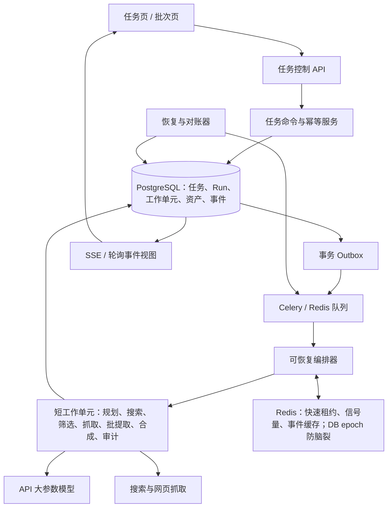
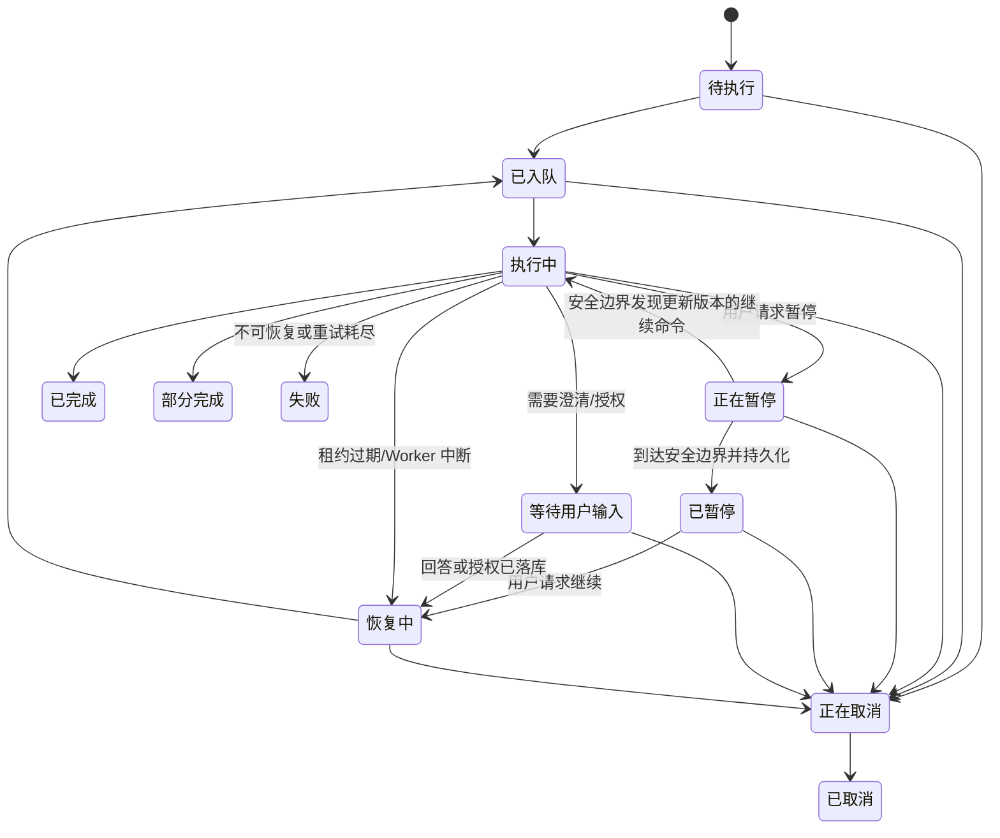

# 长耗时研究任务执行优化设计方案

> 文档状态：专家评审稿
> 版本：v1.3
> 日期：2026-07-14
> 评审状态：已吸收两名外部专家评审意见，并记录采纳结论
> 配套开发WBS：[长耗时研究任务优化开发 WBS](./TASK_EXECUTION_OPTIMIZATION_WBS.md)
> 适用范围：标准任务、多维度 Harness 任务、报告生成与证据审计
> 分析样本：当前任务 `0170494a-c65b-49c0-8594-b8a10e522a85` 及可获得的历史任务、日志、数据库和实现代码
> 本文只提出设计，不包含代码、配置和数据库变更。

## 0. 评审摘要

当前任务耗时过长并非单一模型慢，而是“候选数量放大、逐条串行模型调用、全量重复审计、长任务消息重复投递、状态与预算约束未真正生效”叠加造成的系统性问题。

本方案建议同时实施两条主线：

1. **执行效率主线**：利用现有 API 大参数模型的 1M 上下文，默认尝试把每个维度约 65～80 条候选的紧凑摘要一次性交给模型完成去重、相关性排序和可信度判断；经 POC 发现位置偏差时切换为 2×40 分块初筛加归并。只对 Top 12～20 拉取正文，并按每批 6～10 条进行结构化提取。结合 Skill 动态证据和信息增益早停，将“每条候选一次模型调用”改为“每阶段少量批处理调用”。
2. **可靠执行主线**：把当前数小时的 Celery 单体任务拆成可重入、可持久化的小工作单元；以 PostgreSQL 为任务状态和恢复事实源，以 Redis 承担租约、事件和缓存；提供用户主动暂停/继续、待澄清暂停、Worker/Redis/网络异常后的自动恢复，并通过幂等键和唯一约束保证重复投递不会产生重复业务结果。

预期效果：候选处理阶段模型调用量下降 80% 以上，单维度 Token 消耗下降 60% 以上；标准四维任务 P90 目标由小时级降至 20 分钟以内；暂停期间不产生新的搜索、抓取或付费模型调用；异常恢复不从头执行、不重复写证据和报告。

### 0.1 建议专家重点评审的决策

| 编号 | 待评审决策 | 推荐结论 |
| --- | --- | --- |
| D1 | 是否允许 65～80 条候选一次进入 1M 上下文模型 | 允许作为默认筛选模式，但必须先通过位置偏差 POC，并保留 2×40 分块回退能力 |
| D2 | 详细提取批大小 | 默认 6～10 条/批；用真实样本压测后可按模型输出稳定性调整 |
| D3 | 每维度默认证据目标 | 由 Skill 的 `evidence_policy` 决定；简单任务通常 5～8 条，深度任务可为 10～15 条，并结合信息增益早停 |
| D4 | 暂停语义 | 协作式安全暂停，不强杀已提交的外部请求；停止新调用并在当前原子调用结束后落盘暂停 |
| D5 | 恢复事实源 | PostgreSQL 为唯一持久事实源；Redis 丢失不影响恢复 |
| D6 | 消息可靠性语义 | 接受 Celery 至少一次投递，通过应用层实现业务效果恰好一次，不宣称外部模型调用恰好一次 |
| D7 | 自动恢复策略 | 非业务错误自动恢复，单工作单元最多 3 次；预算、权限、澄清类问题保持暂停等待用户 |
| D8 | 上线方式 | 不保留新旧执行引擎长期双轨或兼容分支；测试和压测通过后，排空旧任务并一次性切换 |
| D9 | Outbox Relay 方案 | 事务 Outbox 保证正确性，`LISTEN/NOTIFY` 负责低延迟唤醒，定时轮询负责漏通知兜底；初期不引入 WAL CDC |
| D10 | 状态机验证方式 | 不建设生产双状态机 Shadow Mode；使用历史事件离线回放和预生产故障演练验证 |

## 1. 项目背景

本项目面向企业售前和客户研究场景，通过 Skill、模板和 Harness 智能体编排，对目标企业及需求方向执行多维信息检索、证据提取、质量评估、报告生成和证据审计。当前标准任务通常包含 4 个研究维度，执行链路涉及搜索服务、网页抓取、API 大参数模型、PostgreSQL、Redis、Celery Worker 和前端任务页。

项目当前实际使用的均为 API 调用的大参数模型，已知上下文窗口为 1M。长上下文为批量处理候选提供了条件，但上下文窗口大不等于输出长度无限、结构化输出必然稳定或调用延迟可以忽略，因此仍需对输入形态、输出规模、重试粒度和上下文利用率进行工程约束。

本次优化的业务目标是：

- 显著缩短任务端到端等待时间，控制模型调用次数、Token 和费用。
- 防止任务候选、证据、审计记录和执行次数失控。
- 让用户看到真实、稳定、可解释的进度和剩余工作。
- 支持用户主动暂停、继续；支持待澄清暂停。
- Worker 重启、网络闪断、Redis 故障或消息重复投递后，可以从最近的持久进度继续。
- 完成状态只代表报告及其必要资产已完整持久化，避免“维度完成但整任务未完成”的状态歧义。

## 2. 当前建设情况

### 2.1 已有能力

| 能力域 | 当前建设情况 | 结论 |
| --- | --- | --- |
| 任务建模 | 已有 Task、Batch、Report、Evidence 等数据库模型 | 具备业务对象基础，但 Task 状态只有 PENDING/RUNNING/COMPLETED/FAILED |
| Harness | 已有规划、研究、提取、评估、反思和多维执行框架 | 主链路可运行，但生产多维任务仍按维度串行、候选逐条串行提取 |
| Skill/模板 | 标准售前任务可按 Skill 配置多个维度 | 已支持当前四维任务场景 |
| 模型调用 | 已接入 API 大参数模型和结构化输出 | 角色/复杂度路由当前基本落到同一模型，批处理能力未利用 |
| Token/预算 | 代码中定义了维度 5 万、任务 20 万 Token 等预算 | 约束未接入生产执行主链路，实际仅起配置/记录作用 |
| Checkpoint | 阶段结束时可保存和加载 Harness 状态 | 仅保存到 Redis，默认 24 小时过期，不能作为可靠恢复事实源 |
| 人工介入 | 有 InterventionManager 和接口定义 | 记录只在进程内存；接口仍硬编码单一维度，也未驱动执行循环真正暂停 |
| 批次暂停 | Batch 有 `paused` 标志，Worker 会等待恢复 | 只阻止继续派发，已经运行的单任务仍会继续执行和消费模型费用 |
| 任务进度 | Redis 中记录阶段、进度、日志和 ETA；前端轮询展示 | 维度间进度会重置，ETA按不稳定百分比外推，前端还有模拟增长 |
| 证据审计 | 有维度审计、报告审计和 Claim 审计能力 | 审计时机和范围不合理，存在无 ID 审计失败、全量串行和重复审计 |
| Celery | 已配置 `task_acks_late=True`、prefetch=1 | 未配置 Redis visibility timeout，长任务存在约 1 小时后重复投递风险 |

### 2.2 设计文档与实际能力的差距

现有 `HARNESS.md` 已描述 Token 财务保护、阶段 Checkpoint 和恢复意图；v3.2～v3.5 PRD/WBS 也规划了 `WAITING_FOR_CLARIFICATION`、暂停期间不消费付费资源和幂等恢复。但现有生产代码尚未形成完整闭环：

- Checkpoint 是 Redis 临时快照，不是数据库中的持久执行账本。
- 人工介入状态没有可靠落库，Worker 不会因接口调用而停止下一次模型调用。
- 恢复只是再次进入原来的大任务函数，由内存状态和阶段字符串决定跳转，无法准确识别已完成的候选批、外部调用和数据库副作用。
- DB Task、Redis TaskStore、维度 Harness 各自更新状态，缺少单一状态所有者。
- 现有批次暂停与本次需要的“正在运行的任务暂停”不是同一能力。

因此，本方案把既有 PRD 中“待澄清暂停”的原则扩展为通用任务控制能力，但不把规划中的能力计入当前已建成范围。

### 2.3 2026-07-20 运行时复核：仍需收口的耗时路径

本次复核以当前耐久执行入口 `execution_worker → ResearchStageHandler → ExtractionStageHandler` 为准，而不是以组件是否存在判断“已经提速”。结论如下：

| 链路 | 当前实际行为 | 对耗时的影响 | 本次方案结论 |
| --- | --- | --- | --- |
| PLAN/SEARCH | 每个维度默认仅持久化一个查询词；同一 PLAN 中的多查询仍由搜索阶段顺序调用 | 搜索数增多时墙钟时间线性增长 | 保留短 WorkUnit 架构；后续搜索并行必须受 Provider 限流、取消语义和调用账本约束 |
| FETCH | 一个 `FETCH` WorkUnit 顺序遍历已选候选；单 URL 的网络超时与指数退避会阻塞同一单元 | 候选较多或失败率较高时，短单元会退化为长单元 | 必须拆为可重入的抓取批次，并给出每批数量、网络硬截止和失败隔离策略 |
| EXTRACT | 已具备 6～10 条批提取组件和幂等 Evidence 写入 | 单次模型调用已从“单候选”降为“批候选”的技术前提 | 不得把“组件存在”表述为端到端收益已实现 |
| 早停 | 提取规划阶段当前会一次性派发所有 `EXTRACT_BATCH` 单元；后续某批得到 `should_stop` 时，已入队批次不会自动撤销 | 已计算的信息增益和充分性结果不能实质减少本次任务调用 | 必须改为“只派发下一批”的闭环调度；未完成前不计入节省指标 |
| 1M 上下文筛选 | 已有 Single/Chunked 影子评测与设计边界，但 G1 机器质量门仍为 `FAIL` | 不能用筛选裁剪正式 Candidate/Evidence | 继续影子运行；只收集质量与成本证据，不影响用户结果 |

这意味着本专项的正确状态是：**耐久、恢复、暂停和批提取数据底座已具备开发验证；端到端“候选漏斗—抓取拆分—增益早停”的运行时降耗闭环尚未完成。** 后续不得以 20/50 压测或单元测试替代真实业务链路的耗时验收。

## 3. 现状数据与问题证据

### 3.1 当前任务分析快照

任务 `0170494a-c65b-49c0-8594-b8a10e522a85` 为上海银行智能客服升级相关标准售前任务，共 4 个维度。以下数据为分析时快照，任务后续状态变化不影响根因判断。

| 指标 | 观测值 | 说明 |
| --- | ---: | --- |
| 启动时间 | 2026-07-14 12:07（Asia/Shanghai） | 当前执行批次 |
| 首维度完成时间 | 12:34:49 | 首维度约耗时 27 分 18 秒 |
| 首维度搜索计划 | 8 条查询 | 每条查询最多返回 10 条 |
| 首维度去重后候选 | 65 条 | 65 条全部进入提取 |
| 首维度证据 | 65 条 | 证据数与候选数相同，缺少有效漏斗 |
| 抽样模型调用 | 63 次 | 平均 24.0 秒，P50 21.5 秒，P90 30.8 秒，最大 65.5 秒 |
| 抽样模型累计延迟 | 1509.5 秒 | 已占首维度绝大多数墙钟时间 |
| 首维度 Token | 112,770 | 是配置的单维度 50,000 Token 上限的约 2.26 倍 |
| 下一维度候选 | 69 条 | 继续进入逐条串行提取 |
| 可见进度 | 34% | ETA曾从约145秒跳到3313秒，缺乏可信度 |

首维度评分为 1 并在第 1 轮完成，说明主要耗时不是多轮反思，而是第一轮把全部候选逐条送入模型。当前提取评分的证据数量项在 5 条左右已经满分，继续从 5 条提取到 65 条没有同等质量收益。

### 3.2 历史任务现象

| 样本 | 现象 | 暴露的问题 |
| --- | --- | --- |
| 13 个可识别多维 Harness 任务 | 3 完成、9 失败、1 为当前任务 | 样本量较小且跨代码版本，不能直接作为总体成功率，但足以说明稳定性需专项治理 |
| 相似四维任务 `3f42621a...` | 端到端约 3 小时 31 分；约启动 1 小时后再次进入多维执行 | 与 Redis 默认 visibility timeout 和 late ack 组合导致的重复投递特征一致 |
| 同一四维任务 | 473 条 Evidence、306 个不同 URL、167 条重复 URL记录 | 重复比例约 35.3%，缺少任务级幂等约束 |
| 相似单维任务 `9890ff1c...` | 单维约 38 分钟、86 条证据、141,307 Token；Worker 重启后再次执行 | 单候选单调用和不可靠恢复同时放大耗时与费用 |
| 多个旧任务 | 长期停留 PENDING/RUNNING | 缺少心跳过期后的状态对账与自动恢复/终止机制 |

### 3.3 状态一致性问题

当前任务在 Redis 中仍为 RUNNING 时，数据库 `finished_at` 已被首个维度的“完成”流程写入。根因是内层单维 Harness 和外层多维编排都在更新任务全局状态：内层完成一个维度就把任务标记为 COMPLETED，外层开始下一维时又改回 RUNNING。

这会进一步引发：

- 用户看到完成、运行中和报告未生成之间的矛盾状态。
- 监控无法准确判断卡死或已完成。
- 自动恢复可能对已完成或正在运行的任务重复入队。
- `finished_at`、进度、ETA 和通知的语义不再可信。

## 4. 根因分析

### 4.1 候选数量缺少漏斗控制

Planner 生成约 8 条搜索词，搜索服务每条最多返回 10 条，去重后自然形成 65～80 条候选。研究评估虽然给出较低质量分，但该分数没有参与候选限流，所有候选仍进入详细提取。

当前链路近似为：

```text
8 条查询 × 10 条结果 → URL 去重 → 65～80 条候选 → 65～80 次模型提取
```

搜索召回量直接线性转化为付费模型调用量，是“数量失控”的第一来源。

### 4.2 逐条串行模型调用决定了墙钟时间

Extractor 对候选执行串行循环，每个候选调用一次模型。按当前观测平均 24 秒计算，65 条候选仅模型等待就约 26 分钟；4 个维度还未计入规划、搜索、抓取、报告生成和审计，理论下限已超过 100 分钟。

Worker 并发为 2 不能解决此问题，因为单个任务内部没有受控并行或批处理，且另一并发槽可能被其他任务占用。

### 4.3 审计范围、时机和粒度错误

- 维度审计在 Evidence 写入数据库并获得 UUID 之前执行，导致空 ID 或 UUID 校验失败后被跳过。
- 报告阶段对数据库中全部 Evidence 逐条串行审计，包括最终报告未引用的证据。
- 重复执行产生的重复 Evidence 又被再次审计，形成乘法放大。
- 历史四维任务的 473 条证据意味着审计链路本身可能再产生数百次模型调用。

### 4.4 长 Celery 任务与 Redis 投递语义不匹配

当前启用 `task_acks_late=True`，但没有显式配置 Redis visibility timeout。Celery Redis 文档说明，未确认消息超过可见性超时会被重新投递；默认值为 1 小时。历史任务约 1 小时后重复开始，时间特征与该机制吻合。参考：[Celery Redis visibility timeout](https://docs.celeryq.dev/en/v5.6.2/getting-started/backends-and-brokers/redis.html#visibility-timeout)。

真正的问题不只是在配置中把 1 小时改大，而是把 3 小时业务流程作为一条消息执行且没有业务幂等。即使超时改为 6 小时，Worker 崩溃后仍只能重放整个任务。

### 4.5 预算、超时和并发约束只存在于配置层

- 单维 50,000 Token、总任务 200,000 Token 的预算已经定义，但生产主路径没有在每次模型调用前执行硬检查。
- `timeout_minutes=30` 主要存在于未被生产多维主链路使用的 TaskHarness 中。
- 自适应并发组件会计算或记录建议并发，但没有形成所有模型调用必须经过的分布式信号量。
- 模型配置中的超时来源不统一，数据库配置与模型网关配置可能不一致。

结果是系统“知道限制是多少”，但不会在越界前停止。

### 4.6 恢复设计不具备持久性和幂等性

当前 Checkpoint：

- 只在 Redis 保存，默认 24 小时 TTL，Redis 丢失或过期即无法恢复。
- 主要在阶段末保存，长时间逐条提取期间没有可靠工作单元账本。
- 完成后会清理，无法用于事后审计。
- 使用阶段状态整体序列化，无法判断某一批外部调用是否已返回、是否已写库。
- Evidence 表缺少任务/维度/规范化 URL 或内容指纹的唯一约束。

因此，消息重投或 Worker 重启时，只能“尽量从某阶段继续”，不能保证不重复调用、不重复写入。

### 4.7 进度和 ETA 不对应真实工作量

当前每个维度内部使用相似的 10%～90% 进度并在下一维重置；TaskStore 用已耗时除以百分比估算 ETA；前端又在真实进度上模拟增加。这三层逻辑都不知道候选总数、已完成批数、剩余维度和审计规模，导致进度跳变、长时间不动和 ETA 大幅波动。

## 5. 优化目标与非目标

### 5.1 目标指标

| 指标 | 当前基线 | 第一阶段目标 | 稳定运行目标 |
| --- | ---: | ---: | ---: |
| 候选处理模型调用/维度 | 65～80 次 | ≤8 次 | Single 3～5 次；Chunked 5～7 次 |
| 单维 Token | 当前样本 112,770 | P90 ≤50,000 | P90 ≤35,000 |
| 标准四维端到端耗时 | 历史样本约 3.5 小时 | P90 ≤40 分钟 | P90 ≤20 分钟 |
| 重复 Evidence | 历史样本约 35.3% | <1% | 数据库约束下为 0 |
| 暂停请求受理 | 无 | P95 ≤2 秒 | P95 ≤1 秒 |
| 从 PAUSING 到 PAUSED | 无 | P95 ≤180 秒 | P95 ≤120 秒 |
| 恢复请求受理 | 无 | P95 ≤2 秒 | P95 ≤1 秒 |
| 恢复后开始有效工作 | 无 | P95 ≤30 秒 | P95 ≤10 秒 |
| 异常检测 | 无统一机制 | ≤90 秒 | ≤60 秒 |
| 异常恢复成功率 | 无可靠数据 | ≥95% | ≥99% |
| 暂停期间新增付费调用 | 无保证 | 0 | 0 |

说明：`PAUSING → PAUSED` 的时间上限受当前已提交外部请求影响。系统可以立即停止下一次调用，但不能承诺已经到达第三方模型服务的请求不计费。通过把单次工作限制在 120 秒以内，才能让暂停等待时间可控。

### 5.2 非目标

- 本次不重写搜索引擎、网页抓取器或报告产品功能。
- 本次不以增加 Worker 数量作为主要优化手段。
- 本次不承诺第三方模型调用物理上的 exactly-once；只保证数据库业务效果不重复。
- 本次不一次性把 80 份网页全文全部交给模型并要求生成 80 份完整结果。
- 本次不保留长期的新旧执行路径兼容代码。

## 6. 总体设计

### 6.1 设计原则

1. **先缩小问题，再调用模型**：确定性 URL/标题去重在前，长上下文模型排序在后，正文抓取和详细提取只针对高价值候选。
2. **批处理但限制故障半径**：1M 上下文用于全量候选理解，输出任务拆成 6～10 条/批，避免超长输出一次失败导致全部重做。
3. **持久资产优先于快照**：搜索结果、网页、模型请求、模型响应、Evidence 和阶段结果都落数据库或对象存储；Checkpoint 只记录指针和游标。
4. **状态只有一个所有者**：编排器负责 Task 全局状态；维度/阶段只能更新自己的运行记录和事件。
5. **至少一次执行、恰好一次效果**：允许消息重投，通过租约、幂等键、输入哈希和唯一约束消除重复副作用。
6. **暂停是业务状态，不是线程阻塞**：暂停后 Worker 释放资源，不用循环睡眠占用并发槽。
7. **预算是审计与提示，不是质量拦截门**：每次外部调用前记录预估消耗，调用完成后按实际 usage 结算；超过门槛只提示和审计，不暂停任务、不阻止调用、不降低强制质量门。

### 6.2 目标架构



PostgreSQL 是恢复和审计的唯一事实源。Redis 故障可以暂时降低调度能力，但不能丢失任务进度。Celery 只负责传递“执行哪个工作单元”，不再承载整个业务流程的唯一状态。

### 6.3 新执行流水线

```text
创建任务
→ 生成维度计划
→ 搜索并确定性去重
→ 65～80 条紧凑候选一次性模型筛选
→ 获取 Top 12～20 正文
→ 每批 6～10 条结构化提取
→ 每批更新字段覆盖和证据充分性
→ 达标早停；不达标时只扩展下一梯队
→ Evidence 落库并获得稳定 ID
→ 生成报告与引用关系
→ 仅审计被引用证据和关键 Claim
→ 原子提交报告与任务完成状态
```

## 7. 1M 上下文候选批处理设计

### 7.1 能否一次处理 80 条候选

结论是**可以，并且推荐作为候选筛选的默认试验方案；不推荐默认用于 80 条完整提取**。生产默认值必须由第 7.7 节 POC 决定，不能仅凭 1M 上下文规格直接写死。

一次筛选请求只包含以下紧凑字段：

```json
{
  "candidate_id": "c_001",
  "title": "...",
  "url": "...",
  "domain": "...",
  "snippet": "...",
  "published_at": "...",
  "source_type": "official|media|procurement|other",
  "fetch_status": "snippet_only|fetched"
}
```

模型只输出候选 ID、相关性、可信度、新颖性、字段覆盖预估、排序和淘汰原因。80 条紧凑候选远低于 1M 上下文上限，而且输出规模可控。

不推荐把 80 份正文一次性要求完整提取，原因是：

- 模型最大输出 Token 通常显著小于上下文窗口，可能在中途截断。
- 80 个复杂 JSON 对象更容易出现漏项、错配 ID 或整体 JSON 无法解析。
- 长输入存在“中间信息关注度下降”，上下文能装下不代表各条质量一致。
- 一次失败会重做全部输入，延迟、费用和故障半径都很大。
- 用户暂停只能等待整个超大调用结束，不利于可控暂停。

### 7.2 四级漏斗

| 层级 | 处理方式 | 规模建议 | 产物 |
| --- | --- | ---: | --- |
| L0 确定性清洗 | 规范化 URL、去追踪参数、标题指纹、同域重复合并 | 65～80 → 40～70 | 唯一候选集 |
| L1 长上下文筛选 | 全部紧凑候选一次进模型 | 40～80 → Top 12～20 | 排名、可信度、覆盖预估、候补队列 |
| L2 正文获取 | 只抓取 Top 候选；失败则由候补补位 | 12～20 | 可引用正文与快照 |
| L3 批量提取 | 每批 6～10 条，结构化输出 | 2～3 批 | Evidence 草稿、字段、引用片段 |
| L4 缺口扩展 | 仅在成功标准未满足时处理下一梯队 | 每次 5～10 条 | 补充 Evidence |

### 7.3 长列表位置偏差与筛选模式

为防范长列表中间位置注意力衰减，筛选能力保留以下参数，但参数只允许通过配置中心和评测发布，不允许散落在业务代码中：

- `screening_mode=auto|single|chunked`
- `screening_batch_size`：默认候选值为 80，回退候选值为 40。
- `screening_top_k`：默认 12～20，由 Skill 决定。
- `screening_order_seed`：由 `task_id + dimension + prompt_version` 生成，保证同版本可复现。

候选顺序不采用每次随机打乱。系统按来源类型、搜索查询、原始排名分位和发布时间做**确定性分层交错**，避免同一来源或同一查询的候选集中在列表中部，同时保留复现实验和审计的能力。

`auto` 模式的两条执行路径为：

1. **Single**：全部 65～80 条紧凑候选一次筛选，调用最少。
2. **Chunked**：2×40 条并行初筛，各取 Top K，再对候选并集做一次归并排序；候选超过 80 时可使用 3×30。该模式调用量更高，但可降低位置偏差和单次失败半径。

系统根据离线召回率、Schema 成功率、位置敏感度和 Provider 延迟选择模式，而不是在运行时凭一次模型回答临时切换。生产发现连续漏检或 JSON 失败超过阈值时，可将配置从 Single 切换为 Chunked，不需要修改代码。

筛选 Prompt 使用明确分区，例如 `<instructions>`、`<criteria>`、`<candidates>`，以减少指令和候选数据互相干扰；输出仍以 API 的 JSON Schema/结构化输出约束为主。XML 标签只是输入组织手段，不作为 JSON 正确性的唯一保证。

不要求模型输出隐藏思维链。每条候选只返回可审计的简短结果字段，例如 `decision`、`reason_code`、`score_vector` 和不超过限定字数的 `reason_summary`，既能检查筛选依据，也不会增加大段 CoT Token 或暴露内部推理。

### 7.4 批量提取协议

- 输入和输出均使用不可变 `candidate_id`，不得依赖数组位置匹配。
- 输出顶层固定为 `{"items": [...]}`，每项必须返回 `candidate_id`、结论、证据片段、字段值、可信度和拒绝原因。
- 调用前记录 `input_hash`、候选 ID 集合、Prompt 版本、模型和 `idempotency_key`。
- 返回后验证“输出 ID 是输入 ID 子集、无重复、必填字段完整、引用片段可在原文定位”。
- 只重试缺失或校验失败的 ID，不重试整个成功批次。
- 每次物理请求都必须设置 `max_output_tokens`；Provider 适配层负责映射为实际 API 使用的 `max_tokens`、`max_completion_tokens` 或同义参数，禁止依赖服务端默认值。
- 单批输入 Token 目标不超过模型上下文的 30%，硬上限不超过 50%，并为系统 Prompt、输出和重试说明预留空间。
- 单批最大预估输出不得超过模型最大输出的 60%；超过则自动减小批大小。

### 7.5 动态证据充分性与信息增益早停

证据数量不是唯一标准，也不能对所有 Skill 固定为 5 条。每个 Skill 必须配置 `evidence_policy`，至少包含：

```yaml
min_evidence: 5
target_evidence: 8
max_evidence: 15
min_distinct_domains: 3
min_trusted_sources: 2
min_evidence_per_critical_claim: 2
max_low_gain_batches: 2
```

简单背景调查可采用 5～8 条，涉及财务、竞品或技术架构交叉验证的深度任务可采用 10～15 条。具体数值由 Skill 评测确定，运行时不得由模型自行放宽关键 Claim 的证据要求。

每完成一批后计算：

```text
can_stop =
    valid_evidence_count >= evidence_policy.min_evidence
    AND must_extract_coverage = 100%
    AND distinct_domains >= evidence_policy.min_distinct_domains
    AND trusted_source_count >= evidence_policy.min_trusted_sources
    AND critical_claims_have_required_support
    AND no_blocking_conflict
    AND quality_score >= dimension_threshold
```

同时计算增量批次的信息增益：新增必填字段覆盖、新增关键 Claim 证据、新来源域、新事实簇和语义新颖度为正向项，内容重复率为负向项。满足以下条件时允许因低信息增益停止扩展：连续两批没有补充关键字段或 Claim，且重复度达到 80% 以上，且不存在阻断冲突。

信息增益早停不能覆盖关键成功标准。即使重复度很高，只要仍缺关键字段、可信来源或交叉验证证据，就必须继续候补扩展或明确输出证据不足。

### 7.6 模型调用量变化

以 65 条候选为例：

| 环节 | 当前 | 目标 |
| --- | ---: | ---: |
| 候选筛选 | 0 | Single 1 次；Chunked 3 次 |
| 详细提取 | 65 次 | 2～3 次 |
| 缺口补充 | 不受控 | 通常 0～1 次 |
| 候选处理小计 | 65 次 | Single 通常 3～5 次；Chunked 通常 5～7 次 |

规划、报告合成等调用另计。即使使用同一大参数模型，调用次数、重复 Prompt、网络往返和输出 Token 都会显著下降。

### 7.7 筛选模式 POC 与发布门槛

P2 全面开发前，从不同 Skill 的历史任务抽取候选集，建立包含“关键证据是否应进入 Top K”的人工复核金标。至少对以下三种方案各运行 3 个确定性位置视图：

| 方案 | 调用形式 | 目的 |
| --- | --- | --- |
| A | 1×80 全量筛选 | 验证最低调用量方案 |
| B | 2×40 初筛 + 1 次归并 | 验证位置偏差和稳定性 |
| C | 3×30 初筛 + 1 次归并 | 验证更小分块的质量上限 |

核心指标包括关键证据 Recall@20、整体 Recall@20、NDCG@20、不同位置视图 Top20 Jaccard、JSON Schema 成功率、P90 延迟、输入/输出 Token 和费用。建议发布门槛为：关键证据 Recall@20 ≥95%、整体 Recall@20 ≥90%、Schema 成功率 ≥99%、Top20 Jaccard ≥0.85；最终选择满足质量门槛且调用最少的方案。门槛应在首轮 POC 后由业务专家确认，不以单一技术指标替代报告质量评审。

## 8. 报告与审计优化

### 8.1 调整审计时机

Evidence 必须先落库并获得稳定 UUID，再进入审计。禁止使用空 ID、临时数组位置或后补映射。

### 8.2 调整审计范围

审计分为两层：

1. **确定性校验**：URL、快照哈希、引用片段存在性、时间、字段类型、重复项等，不调用模型。
2. **模型审计**：只审计报告实际引用的 Evidence、关键 Claim 和存在冲突的证据，不再对未引用候选逐条审计。

同一 Evidence 在相同 `content_hash + audit_policy_version + model_version` 下复用审计结果。报告改写但引用证据未变时，不重复付费审计。

### 8.3 报告上下文构建

- 报告 Prompt 只注入已选 Evidence、结构化字段和引用索引，不注入全部搜索噪声。
- 每条 Evidence 设置稳定 ID，报告中的引用关系单独落表。
- 报告完成的同一事务中写入报告版本、引用关系和任务终态；审计为强制项时必须先完成审计再提交终态。
- 非阻断审计失败可产出明确标记的草稿或 PARTIAL 状态，不得伪装为完整完成。

## 9. 可暂停、可继续、可恢复执行设计

### 9.1 核心语义

本方案统一支持三类暂停：

| 类型 | 触发者 | 恢复方式 | 是否自动恢复 |
| --- | --- | --- | --- |
| 用户主动暂停 | 用户点击暂停 | 用户点击继续 | 否 |
| 待澄清暂停 | 智能体发现重大不确定性 | 用户回答/按假设继续 | 否 |
| 系统保护暂停 | 预算、权限、Provider 熔断或安全策略 | 用户批准或外部条件恢复 | 按策略，默认需明确批准预算/权限 |

“异常中断”不直接等同于失败：Worker 丢失、进程重启、Redis 短暂不可用、网络超时等可恢复技术错误进入 RECOVERING；业务输入无效、权限永久拒绝、重试耗尽才进入 FAILED。

### 9.2 状态模型

Task 同时保存“用户期望状态”和“系统观察状态”，避免暂停/恢复命令与 Worker 状态竞争。

- `desired_state`：`RUNNING | PAUSED | CANCELLED`
- `observed_state`：`PENDING | QUEUED | RUNNING | PAUSING | PAUSED | WAITING_FOR_INPUT | RECOVERING | CANCELLING | COMPLETED | PARTIAL | FAILED | CANCELLED`



COMPLETED、用户已确认接受的 PARTIAL、FAILED 和 CANCELLED 均为终态，不直接恢复。预算不足但仍等待用户决定时必须保持 WAITING_FOR_INPUT，不能提前终结为 PARTIAL。用户希望基于终态成果继续研究时，应创建关联的续研 Run/新报告版本，而不是把原终态改回 RUNNING。

### 9.3 用户暂停流程

1. API 校验任务归属和状态，以请求幂等键写入 `task_commands`。
2. 同一事务把 `desired_state` 改为 PAUSED，写入 `pause_requested` 事件，返回 HTTP 202。
3. Worker 在每次外部调用前、每个批次结束后和阶段切换前检查 `desired_state`。
4. 如果尚未发出外部调用，立即保存游标并进入 PAUSED。
5. 如果外部调用已经发出，不强杀进程；等待返回或超时，将成功响应或失败结果持久化，随后进入 PAUSED；检测到暂停请求后不得再重试当前失败调用。
6. PAUSED 后释放 Worker、Provider 并发令牌和任务租约；不使用占用 Worker 的 sleep 轮询。

用户点击后 UI 立即显示“正在暂停，等待当前模型请求结束”，真正进入 PAUSED 后显示最近持久点和已节省/已消费预算。

### 9.4 继续流程

1. 用户提交继续命令，回答或附加上下文必须先落库。
2. 使用幂等键执行 Compare-And-Set：只有 `desired_state=PAUSED` 且任务处于 PAUSED/WAITING_FOR_INPUT 时创建一次恢复动作。
3. `execution_generation + 1`，状态进入 RECOVERING，恢复器验证最近一个已提交工作单元。
4. 根据数据库中 `task_stage_runs` 和研究资产状态定位下一个未完成单元，已完成单元直接跳过。
5. 通过事务 Outbox 只入队一次；Worker 获取租约后进入 RUNNING。
6. 重复点击继续、页面重试或并发提交同一个幂等键，只返回同一恢复结果，不生成第二条执行链。

### 9.5 异常中断恢复

心跳与执行租约解耦：

- 心跳用于可观测性，Worker 每 10 秒更新一次；心跳短暂丢失只触发告警，不直接抢占执行权。
- 执行租约按工作单元动态计算：`lease_ttl = clamp(工作单元预估 P99 + 60 秒, 90 秒, 300 秒)`。
- Worker 每 `min(30 秒, lease_ttl / 3)` 续租一次。续租失败后不得发起新的外部调用，并在当前安全边界退出。
- PostgreSQL 保存单调递增的 `lease_epoch`（fencing token）和 `lease_expires_at`；Redis 租约只用于快速协调。新 Worker 只有通过数据库 Compare-And-Set 获得更高 `lease_epoch` 后才能执行。
- 每次外部调用前和每次业务写入时都校验 `lease_epoch`。旧 Worker 即使因网络分区晚恢复，也不能提交过期 epoch 的结果，从而避免两个 Worker 同时生效。

恢复对账器每 20 秒扫描：

- `observed_state=RUNNING` 且租约过期 60 秒以上：标记 RECOVERING。
- `desired_state=PAUSED`：直接收敛到 PAUSED，不再入队。
- `desired_state=CANCELLED`：收敛到取消流程。
- `desired_state=RUNNING`：校验工作单元后重新入队。

对账器还需扫描长时间没有获得租约的 QUEUED 工作单元。即使 Redis 队列数据丢失或 Outbox 已标记发布，也会依据 PostgreSQL 中的未完成工作单元重新投递；重复消息仍由 `unit_key` 幂等消除。

恢复粒度是工作单元，不是整个任务。建议边界：

| 阶段 | 最小可恢复单元 | 目标最大耗时 |
| --- | --- | ---: |
| 规划 | 单维度计划 | 2 分钟 |
| 搜索 | 单查询或查询小批 | 1 分钟 |
| 候选筛选 | 单维全量紧凑候选 | 2 分钟 |
| 正文抓取 | 单 URL | 1 分钟 |
| 提取 | 6～10 条候选批 | 2 分钟 |
| 合成 | 报告章节或完整报告版本 | 3 分钟 |
| 审计 | 引用证据/Claim 小批 | 2 分钟 |

### 9.6 外部调用的中断窗口

外部模型请求无法与数据库事务原子提交，必须正视以下极端窗口：模型已计费并返回，但 Worker 在保存响应前崩溃。处理规则：

- 调用前持久化 `STARTED` 记录、输入哈希和幂等键。
- Provider 支持幂等请求键时必须传递同一键。
- Provider 不支持时，只重试该小批；可能重复一次外部费用，但数据库结果仍通过唯一约束只生效一次。
- 记录 `billing_outcome=UNKNOWN` 并纳入费用异常报表，不把未知费用伪装为零。
- 小批化把不可避免的重复费用限制在单个批次，而不是整个任务。

模型 HTTP 客户端必须同时配置连接、连接池、写入、读取和总墙钟截止时间。建议初始值为 `connect=5s`、`pool=5s`、`write=30s`、`read=120s`、外层绝对 deadline `=150s`，再根据 P99 调整。仅设置 `read_timeout` 不足以防止流式响应持续发送少量数据而永不结束，因此必须有不随分块重置的外层绝对 deadline。

外层 deadline 到达后，将调用记录为明确的网络超时并持久化。如果此时 `desired_state=PAUSED`，不再重试，直接进入 PAUSED；否则只按工作单元重试策略处理，不允许 Worker 永久停留在 PAUSING。

## 10. 持久化模型与幂等设计

### 10.1 建议数据实体

| 实体 | 关键字段 | 用途 |
| --- | --- | --- |
| `tasks` | `desired_state`、`observed_state`、`control_version`、`active_run_id`、`execution_generation`、`progress`、`heartbeat_at` | 业务任务和用户可见汇总状态；`control_version` 决定暂停/继续竞态中的最后有效命令 |
| `task_runs` | `run_id`、`generation`、`status`、`started_at`、`ended_at`、`resume_from_run_id`、`failure_class` | 每次初始执行/恢复运行记录 |
| `task_stage_runs` | `dimension`、`stage`、`unit_key`、`status`、`input_hash`、`attempt`、`lease_epoch`、`lease_owner`、`lease_expires_at`、`checkpoint_version`、`asset_ref` | 最小可恢复工作单元和防脑裂 fencing token |
| `external_call_attempts` | `idempotency_key`、`provider`、`model`、`request_hash`、`status`、`raw_response_ref`、Token、费用、延迟 | 外部调用账本和费用审计 |
| `external_call_idempotency_keys` | `idempotency_key`、`attempt_id`、`created_at` | 不分区的紧凑全局防重注册表，避免时间分区破坏全局唯一语义 |
| `research_candidates` | `candidate_id`、规范化 URL、标题指纹、排名、抓取状态、正文哈希 | 让搜索资产可复用、可追踪 |
| `task_commands` | `command_type`、`idempotency_key`、`requested_by`、`status` | 暂停、继续、取消防重 |
| `task_events` | `sequence`、`event_type`、`payload`、`created_at` | 单调事件流和 UI 恢复 |
| `outbox_events` | `topic`、`aggregate_id`、`payload`、`published_at` | DB 状态与消息发布一致性 |

Checkpoint 不再保存整份易过期状态，而是保存 `{task_id, run_id, stage_run_id, checkpoint_version, next_cursor}`；真正的输入、输出和资产按 ID 引用持久化记录。

### 10.2 唯一约束

- `task_runs(task_id, generation)` 唯一。
- `task_stage_runs(run_id, dimension, stage, unit_key)` 唯一。
- `task_commands(task_id, command_type, idempotency_key)` 唯一。
- `external_call_idempotency_keys(idempotency_key)` 唯一；`external_call_attempts` 通过 `attempt_id` 关联。
- `research_candidates(task_id, dimension, canonical_url_hash)` 唯一。
- `evidences(task_id, dimension, canonical_url_hash, content_hash)` 唯一。
- `reports(task_id, version)` 唯一。
- `evidence_audits(evidence_id, content_hash, policy_version, model_version)` 唯一。

规范化 URL 不足以识别所有重复内容，因此 Evidence 使用 URL 哈希和内容哈希组合；相同内容的不同镜像可在应用层关联为同一证据簇，但保留来源审计记录。

### 10.3 Outbox Relay 选型

采用**事务 Outbox + `LISTEN/NOTIFY` 低延迟唤醒 + 定时轮询兜底**的混合方案：

1. 业务事务写入 `outbox_events`，并在同一事务中执行仅携带 Outbox ID 的 `pg_notify`；通知只负责“有新数据”的提示，完整载荷始终在表中。
2. Relay 常驻连接执行 `LISTEN`。收到通知后，使用 `FOR UPDATE SKIP LOCKED` 按 `created_at, id` 稳定排序批量锁定未发布行，建议每批最多 100 条。
3. 无论是否收到通知，Relay 都每 2 秒扫描一次未发布行；空闲时可退避到 5 秒。这样，连接重建、通知丢失或 Relay 重启都不会丢任务。
4. 为 `published_at IS NULL` 建立部分索引，已发布历史行不参与热扫描。
5. 发布成功后按幂等消息 ID 标记 `published_at`；发布成功但标记前崩溃只会造成重复消息，由工作单元幂等消除。

不单独依赖 `LISTEN/NOTIFY`，因为监听只面向当前已注册会话，连接建立也存在需要先监听再读取数据库状态的竞态；PostgreSQL 官方建议监听建立后重新检查数据库状态。[PostgreSQL LISTEN](https://www.postgresql.org/docs/current/sql-listen.html) 和 [NOTIFY](https://www.postgresql.org/docs/current/sql-notify.html) 也明确了通知在事务提交后交付。`SKIP LOCKED` 适合多个消费者读取队列式表，但必须配合数据库表作为事实源。[PostgreSQL SELECT locking clause](https://www.postgresql.org/docs/current/sql-select.html#SQL-FOR-UPDATE-SHARE)

当前规模不建议直接引入基于 WAL 的 CDC：它会增加复制槽、运维、权限和故障处理复杂度。只有当 Outbox 持续吞吐超过简单 Relay 容量、轮询造成可测数据库压力或需要跨多个下游时，再单独评审 CDC。目标 SLO 为 Outbox 提交到进入 Celery 队列的 P95 延迟不超过 2 秒。

### 10.4 事务边界

每个工作单元完成时，在同一数据库事务中：

1. 幂等写入业务产物。
2. 将工作单元标记为 COMPLETED。
3. 更新任务汇总进度和最近持久点。
4. 写入下一工作单元的 Outbox 事件。

Outbox 发布器成功投递后再标记 `published_at`。即使发布器重复发送，接收端也因 `unit_key` 唯一而不会重复生效。

### 10.5 哈希索引与数据生命周期

- URL 和内容哈希统一使用二进制 SHA-256，PostgreSQL 列类型采用 `bytea`（32 字节），不使用 64 字符十六进制 `varchar` 建唯一索引。
- 不采用 MD5 作为业务幂等依据，避免用更高碰撞风险换取有限索引空间；也不把普通哈希强行转换为语义不一致的 UUID。
- `external_call_attempts` 和 `task_events` 是月度 Range 分区的候选表，但必须先完成 DBA 压测和唯一约束设计；Task、Report、Evidence 等核心业务表保持普通表，避免过早分区。
- PostgreSQL 时间分区表的唯一约束设计必须包含分区键。为保留全局幂等，可将 `external_call_idempotency_keys` 设计为不分区的紧凑注册表，只存 `idempotency_key → attempt_id`；大体量请求/响应元数据再按月进入 `external_call_attempts`。事件序号由 Task 行原子分配，分区表保存 `(created_month, task_id, sequence)`。
- `outbox_events` 初期不分区，依靠 `published_at IS NULL` 部分索引和 7 天清理控制热表规模；只有实际容量评测证明需要时再拆分去重注册表和历史分区。
- 建议默认热数据周期：`task_events` 90 天、外部调用元数据 180 天、已发布 Outbox 7 天。超期数据转入低成本归档或删除，最终周期必须经过安全、财务审计和客户合同评审。
- 原始 Prompt/Response 不直接长期堆积在主库。需要保留时写入加密对象存储，数据库只保存引用、内容哈希、脱敏摘要和 Token/费用元数据；敏感数据按更短周期清理。
- 每个分区都要验证唯一性策略、查询裁剪、Autovacuum 和归档作业；分区不是免维护手段。

## 11. 调度、超时与并发治理

### 11.1 Celery 消息拆分

把当前 `execute_multi_dimension_harness` 的小时级单体消息拆为分钟级工作单元。`acks_late` 可以保留，但确认发生在工作单元成功提交之后。

`worker_prefetch_multiplier=1` 必须作为生产配置和发布自检项。当前配置已经是 1，本次不是新增能力，而是防止重构后回退；否则 Worker 会把多个工作单元预取到本地，造成任务分配不均，并扩大暂停和 Worker 崩溃时的重投范围。Celery 官方配置文档也将 1 作为关闭多任务预取的配置方式：[Celery configuration](https://docs.celeryq.dev/en/stable/userguide/configuration.html#worker-prefetch-multiplier)。

Redis visibility timeout 作为保护配置，三个相关配置保持一致，并满足：

```text
visibility_timeout >= max(900 秒, 3 × 工作单元 P99 耗时)
```

它只是消息层保险，不替代租约、幂等和工作单元拆分。

### 11.2 并发模型

- 所有模型调用必须先获得 Provider 级分布式信号量。
- 初始上限采用当前预算中心的 2 路模型并发，不直接使用包含禁用 Provider 的理论容量。
- 允许最多 2 个维度并行，但任务内和任务间共享同一全局模型令牌，禁止“维度并行 × 批内并行 × Worker 并发”乘法失控。
- 搜索和抓取使用独立并发池，按域名限速，不占用模型并发令牌。
- 收集 P50/P90/P99、429、超时和错误率后，AIMD 调整并发；自适应结果必须真正作用于信号量。

### 11.3 超时层级

| 层级 | 建议策略 |
| --- | --- |
| 单模型请求 | connect 5 秒、pool 5 秒、write 30 秒、read 120 秒、总墙钟 150 秒；最多一次快速重试，不得由多个配置源互相覆盖 |
| 搜索/抓取 | 连接、读取、总时长分别设限；反爬失败快速降级到 snippet |
| 工作单元 | 180 秒软截止、240 秒硬截止 |
| 单维度 | 软截止 10 分钟，允许产出有缺口的结果；硬截止 15 分钟 |
| 标准任务 | 软截止 30 分钟，硬截止 45 分钟；到限时进入 PARTIAL/等待用户，而非无限执行 |

硬截止不等于进程强杀并丢状态。Worker 应在截止前停止新调用并提交已完成资产。

## 12. Token、费用与模型策略

### 12.1 预算记账与软告警

每次调用执行“预估记录—结算”：

1. Token 估算器根据输入和最大输出计算本次最坏消耗。
2. 在数据库中原子记录维度/任务预估消耗。
3. 达到或超过阈值时写入提示和审计事件，但仍按质量目标发起请求。
4. 调用结束按实际 usage 结算，多退少补。

账本必须使用 PostgreSQL 原子更新，并按任务/维度拆分预算行，避免所有任务争用一条全局记录。Redis 可以缓存余额，但不能成为预算权威账本；Redis 丢失、异步落库延迟或主从切换不得影响真实账目。

Provider Payload 必须显式设置适合任务质量的 `max_output_tokens`；该上限用于单次响应完整性和物理保护，不以预算阈值压缩输出。

预算覆盖 Token、金额、调用次数和墙钟时间四类指标。达到80%、95%和100%时展示对应提示、预计超额和审计信息，不停止新调用，也不要求用户批准后才能继续。

### 12.2 分级降级与 PARTIAL 交付标准

| 预算使用率 | 执行策略 | 状态处理 |
| --- | --- | --- |
| `<80%` | 正常执行 Skill 计划 | RUNNING |
| `80%～95%` | 展示预算提示和预计超额；不改变候选数量、模型输出上限或质量策略 | RUNNING |
| `95%～100%` | 强化提示与审计；不缩减核心或非核心调用 | RUNNING |
| `100%` | 标记超额并持续审计；不禁止新付费调用 | RUNNING |

不默认把提取批从 10 条缩成 5 条作为降本措施，因为候选总数不变时，小批次可能增加重复 Prompt 和网络开销。质量策略只能由证据充分性和信息增益决定，不得由预算阈值自动改变。

强制质量门不得静默降级。关键 Evidence、关键 Claim 审计或安全审计未完成时，任务不能标记 COMPLETED。`PARTIAL` 至少包含：

- 明显的部分完成标识和终止原因。
- 已完成维度、未完成维度、缺失字段和未验证 Claim。
- 已获得 Evidence 及可验证引用，不输出无证据填充内容。
- 已消耗预算、继续研究预计预算和下一步操作。
- 报告版本与审计状态，且不发送“完整报告已完成”的通知。

Skill 需要明确 `on_budget_exhausted=pause|partial`。选择 `pause` 时任务保持可继续；选择并确认 `partial` 后 PARTIAL 为终态，如需继续研究则创建关联的续研 Run/新报告版本，不把已终结任务直接改回 RUNNING。

### 12.3 模型使用策略

当前所有角色均通过 API 大参数模型执行，本方案不依赖小模型也可落地：

- 候选排序：低温度、小输出、严格 JSON Schema。
- 批量提取：低温度、逐 candidate ID 输出、限制每条最大字数。
- 报告合成：使用强推理配置，但只输入高质量 Evidence。
- 引用审计：结构化判定，按引用小批处理。

后续只有在离线评测证明质量不下降时，才引入更快/更低成本模型路由；不是本次方案成立的前提。

## 13. 用户体验设计

### 13.1 真实进度

进度按有权重的稳定里程碑计算，不再由已耗时/百分比互相推算，也不在前端模拟增长。

| 里程碑 | 建议权重 |
| --- | ---: |
| 初始化与计划 | 5% |
| 多维搜索与去重 | 15% |
| 候选筛选 | 10% |
| 正文获取 | 15% |
| 批量提取与证据充分性 | 30% |
| 报告合成 | 15% |
| 引用审计与提交 | 10% |

多维任务在上述阶段内按维度数和批次数细分。动态补充研究使用预留权重，进度只增不减。若工作范围扩大，UI 显示“增加 1 批补充研究”，而不是回退百分比。

### 13.2 任务页信息

任务页应展示：

- 当前状态：执行中、正在暂停、已暂停、等待澄清、恢复中、部分完成等。
- 当前阶段和维度：如“第 2/4 维度—提取第 1/2 批”。
- 已完成工作量：候选 69、筛选 16、正文 14、有效证据 6。
- 最近心跳和最近持久点。
- 已使用/预算 Token、金额和时间。
- ETA 区间与置信度，例如“预计 6～9 分钟”，而不是频繁跳动的单点秒数。
- 暂停、继续和取消按钮；PAUSING 时说明正在等待哪个原子调用。
- 异常恢复提示：“Worker 中断，已从提取第 2 批恢复，已完成结果不会重做”。
- 已完成维度和部分结果可提前查看。

展示优先级为“状态与剩余工作量 > 当前产物 > ETA”。主文案优先使用“第 2/3 批，剩余 12 条候选”，ETA 作为带置信度的辅助信息；Provider 延迟方差过大时可以隐藏 ETA，不显示虚假的精确倒计时。

### 13.3 SSE 与增量成果

SSE 用于推送**已经校验并持久化的业务事件**，例如候选筛选完成、提取批完成、Evidence 通过校验、报告章节已保存和任务状态变化。客户端使用 `event_sequence` 断线续传，页面刷新后从数据库事件流恢复。

不直接把原始模型 Token、未闭合 JSON、隐藏思维链或未经证据校验的报告文字推送给用户。这样做虽然看起来“更流畅”，但会造成内容闪烁、错误信息先展示、断线后无法重建以及潜在内部推理泄露。报告生成阶段可在完整章节通过校验并保存后增量展示章节快照，兼顾等待体验和可恢复性。

### 13.4 ETA 算法

ETA 使用历史同 Skill、维度、阶段和批大小的 P50/P90 耗时，再加当前剩余工作单元，不依赖虚拟百分比。样本不足时只展示阶段和工作量，不展示不可信 ETA。

## 14. API 设计建议

| 方法与路径 | 语义 | 关键行为 |
| --- | --- | --- |
| `POST /api/tasks/{id}/pause` | 请求暂停 | Header/Body 带幂等键；返回 202 和当前状态 |
| `POST /api/tasks/{id}/resume` | 请求继续 | 只允许 PAUSED/WAITING_FOR_INPUT；返回恢复 Run ID |
| `POST /api/tasks/{id}/cancel` | 请求取消 | 协作式停止并保留审计资产 |
| `GET /api/tasks/{id}/execution` | 获取执行视图 | 状态、阶段、工作量、预算、心跳、恢复信息 |
| `GET /api/tasks/{id}/events` | 获取增量事件 | 支持 `after_sequence`，用于刷新/断线续传 |
| `POST /api/tasks/{id}/clarifications/{cid}/answer` | 回答澄清 | 回答先落库，再触发幂等恢复 |

统一响应规则：

- 合法异步命令返回 202。
- 重复幂等键返回首次命令结果。
- 重复暂停已暂停任务、重复继续运行中任务可返回 200 和当前状态，不制造新 Run。
- 非法状态迁移返回 409，而不是泛化 400。
- 不属于当前用户/Workspace 的任务返回 404，避免泄露存在性。

## 15. 可观测性与运行治理

### 15.1 必备指标

- `task_duration_seconds{skill,status}`
- `stage_duration_seconds{stage,dimension}`
- `candidates_recalled/selected/fetched/extracted/accepted`
- `llm_calls/tokens/cost{role,model,status}`
- `external_call_latency_seconds{provider,role}`
- `task_pause_latency_seconds`
- `task_recovery_latency_seconds`、`task_recovery_count`
- `duplicate_delivery_count`、`idempotency_conflict_count`
- `evidence_duplicate_rejected_count`
- `lease_expired_count`、`stale_task_count`
- `eta_absolute_error_seconds`

### 15.2 关联标识

日志、指标和外部调用统一携带：`task_id`、`run_id`、`stage_run_id`、`unit_key`、`candidate_batch_id`、`external_call_id`。禁止只靠自然语言日志追踪一次恢复。

### 15.3 告警

- 单工作单元超过 P99 或 4 分钟。
- 任务 60 秒无心跳。
- 同任务出现两个有效租约。
- 单维 Token 超预算 80%。
- 候选提取接受率异常接近 100%，提示漏斗失效。
- Evidence 唯一约束冲突突然升高。
- 恢复次数超过 2 次或外部调用费用状态 UNKNOWN。

## 16. 实施计划

遵守每个原子任务最多修改 3 个文件的原则，后续实施拆为以下交付，不在一个变更中跨越全部层次。

| 阶段 | 原子交付 | 建议文件数 | 验收重点 |
| --- | --- | ---: | --- |
| P0 | 建立当前任务耗时、调用、Token、重复率基线 | ≤3 | 指标能还原本次任务漏斗和模型耗时 |
| P1 | 确定性候选去重与稳定 candidate ID | ≤3 | URL 参数、镜像、标题重复测试通过 |
| P2 | Single/Chunked 自适应候选筛选 | ≤3 | JSON Schema、位置偏差、漏 ID、重复 ID、超长输入测试通过 |
| P3 | 6～10 条批量提取和缺失项重试 | ≤3 | 单项失败不重做整批，引用可定位 |
| P4 | Skill 动态证据策略、信息增益早停与候补扩展 | ≤3 | 字段/来源/Claim/冲突门槛通过，低信息增益停止但不漏关键项 |
| P5 | Evidence 先落库、引用审计去重 | ≤3 | 空 UUID 不再发生，未引用证据不调用模型审计 |
| P6 | Run/Stage/Command/Outbox 数据模型 | ≤3 | 迁移、哈希类型、唯一约束、Relay、并发写入测试通过 |
| P7 | 用户暂停/继续服务 | ≤3 | 幂等命令、非法迁移、权限测试通过 |
| P8 | Worker 安全边界与短工作单元 | ≤3 | 暂停期间无新增调用，恢复跳过已完成单元 |
| P9 | 动态租约、fencing token 和异常对账器 | ≤3 | kill Worker、网络分区、Redis 重启、旧 epoch 写入拒绝通过 |
| P10 | 真实进度、事件和任务页交互 | 每个子交付≤3 | 刷新/断线恢复、进度单调、PAUSING 文案正确 |
| P11 | 压测、故障演练和一次性切换 | 每个子交付≤3 | KPI 达标后才允许生产切换 |

### 16.1 推荐实施顺序

1. 完成 P0～P1 后先通过 G1 筛选 POC，再进入 P2～P5，直接降低模型调用、Token 和审计规模。
2. P6 开发前通过 G2 DBA 专项评审；再完成 P6～P9，建立持久、可暂停、可恢复的执行底座。
3. P9 完成后通过 G3 历史事件离线回放和预生产故障演练，不在生产维持新旧双状态机。
4. 完成 P10，将真实状态、增量成果和控制能力交付用户。
5. 用 20/50/100 个任务的阶梯压测和故障演练验证 P11。

### 16.2 实施门禁

| 门禁 | 时机 | 必须通过的内容 |
| --- | --- | --- |
| G1 模型筛选 POC | P2 前 | 对比 1×80、2×40、3×30 的召回、位置稳定性、结构化成功率、延迟和费用；固化 Prompt 与参数 |
| G2 DBA Review | P6 前 | Review `bytea` 哈希、全局幂等注册表、分区约束、部分索引、预算条件更新锁粒度和归档计划 |
| G3 状态机回放 | P10 前 | 将历史日志/事件转换为只读输入，离线驱动新状态转换器，对比期望状态、恢复点和重复副作用 |
| G4 PARTIAL 业务确认 | P10 前 | 业务方确认各 Skill 最低交付物、可跳过步骤、暂停或部分完成策略和通知文案 |

不采纳生产双状态机 Shadow Mode。生产旁路同时维护两套状态会引入新的状态一致性、存储和清理问题，也属于本方案明确不保留的运行时兼容路径。离线事件回放可以验证状态转换，对线上业务零写入；预生产再通过真实 Worker kill、网络分区和重复消息验证对账器。

### 16.3 上线与切换

- 不建设长期双轨执行和运行时兼容分支。
- 在维护窗口停止接收新研究任务，排空旧版 Celery 活跃/保留/计划队列。
- 无法排空的旧任务先保留报告、Evidence 和日志快照，再明确取消，不让新旧 Worker 同时处理同一任务。
- 执行一次性数据库迁移并部署新 Worker；通过烟测后恢复入口。
- 新表尽量采用可回滚的增量迁移，但业务切换保持单路径。

## 17. 测试与验收方案

### 17.1 功能边缘情况

| 场景 | 预期结果 |
| --- | --- |
| 80 条候选包含大量重复 URL/标题 | 确定性去重后再筛选，重复项不进入提取 |
| 关键候选分别位于列表头部、中部和尾部 | Single/Chunked 的 Recall@20 和位置稳定性达到 POC 门槛 |
| Single 模式连续出现位置漏检 | 通过配置切换 2×40 + 归并，不修改业务代码 |
| 模型筛选遗漏 candidate ID | 只补偿遗漏 ID；不重做已通过项 |
| 批量输出 JSON 截断 | 自动缩小批次并重试失败批；已有批次保留 |
| Provider 忽略或不支持输出上限字段 | 适配层在发起请求前失败，不允许使用服务端默认无限输出 |
| Top 结果正文抓取失败 | 使用候补补位；必要时降级 snippet 并降低可信度 |
| 5 条证据但字段未覆盖 | 不早停，按缺口扩展下一梯队 |
| 连续两批重复度超过 80% 但仍缺关键 Claim | 不触发低信息增益早停，继续候补或输出明确缺口 |
| 20 条仍无可靠证据 | 结束为 PARTIAL/证据不足，不继续处理全部噪声 |
| 暂停发生在模型调用前 | 不发起调用，数秒内 PAUSED |
| 暂停发生在模型调用中 | 不发下一调用；当前调用返回/超时并落盘后 PAUSED |
| PAUSING 时用户又点击继续 | 命令按序列处理，最终 desired_state 决定是否在安全点重新入队 |
| 多次并发点击继续 | 只创建一个新 generation 和一个恢复消息 |
| 暂停数小时或超过 Redis TTL | 仍可从 PostgreSQL 恢复 |
| Worker 在外部调用前崩溃 | 重新执行该工作单元，不产生业务重复 |
| Worker 在外部调用返回后、落库前崩溃 | 仅重试该小批；唯一约束保证结果不重复，费用标记可审计 |
| Worker 在落库后、ack 前崩溃 | 重投消息识别工作单元已完成并直接确认 |
| 旧 Worker 网络分区后恢复 | 旧 `lease_epoch` 的外部调用前检查和数据库写入均被拒绝 |
| Redis 重启/清空 | 任务持久状态不丢失，恢复器重建租约和事件缓存 |
| `LISTEN/NOTIFY` 连接中断或漏通知 | 轮询在 5 秒内发现未发布 Outbox 并正常投递 |
| 数据库短暂不可用 | 不发新外部调用；重连后继续，不靠内存假定成功 |
| 模型流式连接持续小数据但不结束 | 外层绝对 deadline 生效，调用落为超时，PAUSING 可收敛到 PAUSED |
| Provider 429/超时 | 退避、受控重试；超过阈值进入系统保护暂停或 PARTIAL |
| 预算跨越 80%、95%、100% | 分别进入保守、核心交付和禁止新调用策略；结算退还差额 |
| 报告已写入、完成状态提交前崩溃 | 同一事务或幂等恢复后只生成一个报告版本 |
| SSE 断线重连 | 从 `event_sequence` 继续，只展示已持久化成果，不重复或泄露原始模型流 |
| 批量任务中一行暂停 | 仅该 Task 暂停，其他行继续；Batch 汇总显示部分暂停 |
| 用户取消已暂停任务 | 进入 CANCELLED，保留已完成资产，不再允许 resume |

### 17.2 故障演练

- 在规划、搜索、筛选、提取、合成、审计每个阶段分别 kill Worker。
- 人为将消息延迟超过 visibility timeout，验证不会产生重复 Evidence/Report。
- 并发投递相同 `unit_key` 10 次，验证只有一个有效执行者。
- 清空 Redis，验证 PostgreSQL 恢复路径。
- 模拟模型返回 429、500、120 秒超时、无 usage、非法 JSON 和部分 JSON。
- 模拟 connect/pool/write/read 超时以及流式响应超过 150 秒绝对 deadline。
- 模拟用户连续执行“暂停—继续—暂停—取消”和网络重放。
- 将候选数扩展至 20/80/200，验证 Token 估算、分批和早停不会失控。
- 让旧 Worker 在租约到期后恢复写入，验证 fencing token 拒绝旧 epoch。
- 停止 Outbox LISTEN 连接但保留轮询，再停止轮询后重启 Relay，分别验证低延迟路径和正确性兜底。

### 17.3 发布门槛

- 连续 100 个标准任务无重复报告、Evidence 和审计副作用。
- 100% 暂停用例在进入 PAUSED 后无新增搜索、抓取、模型调用。
- 所有故障点均从最近完成工作单元继续，不从任务起点重跑。
- 标准四维任务 P90 耗时、Token 和调用量达到第一阶段目标。
- 候选筛选达到第 7.7 节 POC 的 Recall、Schema 和位置稳定性门槛。
- Outbox 到 Celery 队列 P95 延迟不超过 2 秒，漏通知时仍在 5 秒内恢复投递。
- 进度保持单调，ETA P90 绝对误差低于实际剩余时间的 30%。
- SSE 只包含已持久化、可重放的业务事件，不包含原始 CoT 或未校验模型 Token。
- 任务只有在报告、引用和要求的审计全部持久化后才进入 COMPLETED。

## 18. 风险与权衡

| 风险 | 影响 | 控制措施 |
| --- | --- | --- |
| 批处理导致某些候选被模型忽略 | 漏证据 | 稳定 ID、输出集合校验、候补扩展、离线召回评测 |
| 长列表位置偏差 | 中部关键候选被误淘汰 | 确定性分层交错、位置视图 POC、2×40 Chunked 回退 |
| 大批输入增加单次延迟 | 暂停等待变长 | 筛选只用紧凑字段；详细提取保持 6～10 条小批 |
| 早停降低证据多样性 | 报告片面 | 把字段覆盖、来源多样性、冲突作为硬门槛 |
| 数据模型增加实现复杂度 | 交付周期增加 | 分阶段交付；先降调用，再建设恢复底座 |
| Provider 不支持幂等请求 | 极端崩溃窗口可能重复计费 | 小工作单元、调用账本、UNKNOWN 费用审计、数据库业务去重 |
| 两维并行放大 Provider 压力 | 429、超时 | 全局分布式信号量和 AIMD，禁止嵌套并发失控 |
| Outbox 轮询形成数据库热点 | 投递延迟或 DB 压力 | LISTEN/NOTIFY 唤醒、未发布部分索引、SKIP LOCKED 小批领取、空闲退避 |
| 动态租约发生网络分区脑裂 | 两个 Worker 同时产生费用或写入 | DB `lease_epoch` fencing，旧 epoch 禁止新调用和提交 |
| 自动降级掩盖质量缺口 | 用户把草稿当完整报告 | 强制质量门不可跳过，PARTIAL 明示缺口且不发送完成通知 |
| 一次性切换存在发布风险 | 短暂停机 | 预生产全量演练、维护窗口排空、可逆数据库迁移 |

## 19. 两名专家意见处理结论

| 专家意见 | 处理结论 | 处理方式与理由 |
| --- | --- | --- |
| 保留 `SCREENING_BATCH_SIZE`，必要时 40 条分块 | 采纳 | 增加 Single/Chunked/Auto 和 2×40 回退，生产值由 POC 决定 |
| 候选随机打乱或 2～3 Chunk | 部分采纳 | 采纳分块；随机改为按稳定种子确定性分层交错，避免不可复现 |
| 防范 Lost in the Middle | 采纳 | 增加位置视图 POC、Recall@20、Top20 Jaccard 和配置化回退门槛 |
| 每次 Payload 强制 `max_tokens` | 采纳 | 统一抽象为 `max_output_tokens`，由 Provider 适配层映射真实字段，并与预算预留绑定 |
| XML 分隔 Prompt | 部分采纳 | 用作指令/标准/数据分区；JSON 正确性仍依赖 API Schema 和返回校验，不夸大 XML 效果 |
| 强制输出 CoT | 不采纳 | CoT 增加 Token、泄露内部推理且不等于更高准确率；改为简短 reason code、评分向量和结果摘要 |
| Skill 动态证据阈值 | 采纳 | 新增 `evidence_policy`，简单任务 5～8，深度任务可为 10～15 |
| 信息增益早停 | 采纳 | 新增字段、Claim、来源、事实簇和重复度指标；不允许覆盖关键缺口 |
| Outbox 使用轮询或 LISTEN/NOTIFY | 组合采纳 | 明确采用事务 Outbox 保正确、LISTEN/NOTIFY 唤醒、2 秒轮询兜底；初期不引入 WAL CDC |
| 外部调用账本和事件表分区/TTL | 采纳并修正 | 规划月度分区和归档；全局幂等键使用非分区紧凑注册表，避免分区唯一约束冲突 |
| 哈希改用 MD5/UUID/bytea | 部分采纳 | 采纳 `bytea`，但保留二进制 SHA-256；不采用碰撞风险更高的 MD5，也不把普通哈希伪装成 UUID |
| HTTP 绝对超时 | 采纳 | 增加 connect/pool/write/read 和 150 秒总墙钟 deadline，覆盖流式假活连接 |
| `worker_prefetch_multiplier=1` | 采纳为发布门 | 当前已经配置为 1，保留并增加启动自检，防止后续回退 |
| 心跳与租约解耦、动态租约 | 采纳并修正 | 心跳只监控；租约动态 TTL，但仍周期续租，避免固定长租约导致恢复过慢 |
| 影子 Worker 防脑裂 | 采纳其目标 | 使用数据库 `lease_epoch` fencing token，不使用一个真正执行外部调用的影子 Worker |
| 生产状态机 Shadow Mode | 不按原方案采纳 | 不维护生产双状态；改为历史事件离线回放和预生产故障演练，避免新增兼容分支 |
| 预算 80%/100% 智能降级 | 部分采纳 | 增加 80%/95%/100% 分级策略；不静默降低强制质量门，也不默认缩小批次造成更多 Prompt 开销 |
| Redis 原子预扣、异步落库 | 不采纳为权威路径 | 与 PostgreSQL 单一事实源冲突，Redis 丢失会产生超支风险；采用 DB 条件更新，Redis 只做缓存/快速拒绝 |
| 强化剩余批次/候选展示 | 采纳 | 明确其优先级高于 ETA，Provider 方差过大时隐藏精确 ETA |
| 直接流式推送 Evidence/报告 Token | 部分采纳 | SSE 推送已校验并持久化的批次、Evidence 和章节快照；不推送原始 Token、破损 JSON 或 CoT |
| P2 前模型 POC、P6 前 DBA Review | 采纳 | 新增 G1、G2 实施门禁和量化发布指标 |
| 明确 PARTIAL 交付物 | 采纳 | 增加部分状态、缺口、引用、预算和续研方式，禁止冒充完整报告 |

### 19.1 Outbox 选型明确答复

当前项目优先采用**混合 Relay**，而不是三选一：

- PostgreSQL Outbox 表是唯一可靠队列账本。
- `LISTEN/NOTIFY` 负责把正常路径延迟降到秒级以内。
- 2 秒轮询负责连接断开、通知竞态和进程重启后的正确性兜底。
- `FOR UPDATE SKIP LOCKED` 支持多个 Relay 并发领取。
- 暂不使用 WAL CDC；当实测吞吐、跨下游数量或轮询压力达到独立评审门槛时再引入。

该选择适合当前系统规模，也保留后续演进空间；最关键的是任何通知丢失都不会让工作单元永久停滞。

## 20. 评审结论建议

建议本次评审批准以下总体路线：

1. 批准“Single/Chunked 自适应紧凑候选筛选 + Top 12～20 正文 + 6～10 条批量提取 + Skill 动态证据/信息增益早停”的主流程。
2. 批准把多小时 Celery 任务拆为分钟级可重入工作单元，并以 PostgreSQL 作为恢复事实源。
3. 批准用户暂停/继续、待澄清暂停和异常自动恢复共用同一状态机、命令幂等和资产持久化机制。
4. 批准仅保证业务效果恰好一次；对不支持幂等键的第三方模型，明确记录极端中断窗口的重复费用风险。
5. 批准预算、超时、并发、候选量和审计范围成为生产执行硬门，而不是仅用于日志展示。
6. 批准事务 Outbox + LISTEN/NOTIFY + 轮询兜底的混合 Relay，以及数据库 fencing token 防脑裂机制。
7. 批准按 P0～P11 原子交付和 G1～G4 门禁实施，先解决调用数量和审计放大，再交付完整暂停恢复能力。

## 附录 A：当前实现定位

| 现象 | 主要实现位置 |
| --- | --- |
| 多维任务顺序执行、全局状态被内外层重复更新 | `backend/app/worker/harness_worker.py` |
| 候选逐条串行提取 | `backend/app/agents/agents/extractor_agent.py` |
| 搜索候选进入提取缺少漏斗 | `backend/app/agents/harness/agent_harness.py`、研究 Agent |
| Checkpoint 仅 Redis、24 小时 TTL | `backend/app/agents/harness/checkpoint.py` |
| 人工介入未真正持久化 | `backend/app/agents/harness/human_intervention.py` |
| 介入接口硬编码维度且不驱动执行暂停 | `backend/app/api/harness_routes.py` |
| DB Task 状态不支持暂停/恢复 | `backend/app/db/models.py` |
| 批次暂停仅控制后续派发 | `backend/app/api/batch_routes.py`、`backend/app/worker/batch_worker.py` |
| late ack 且未配置 visibility timeout | `backend/app/worker/celery_app.py` |
| 进度与 ETA 外推 | `backend/app/api/task_store.py`、任务详情前端页面 |

## 附录 B：术语

- **Run**：一次初始执行或恢复执行实例；同一 Task 可有多个 Run，但同一时刻只能有一个有效租约。
- **工作单元**：可独立重试和提交的最小执行片段，例如一批候选提取。
- **安全边界**：当前工作单元结果已持久化，尚未发起下一个外部调用的位置。
- **业务效果恰好一次**：即使消息或 Worker 重复执行，Evidence、报告、审计、预算结算等数据库副作用只生效一次。
- **候选**：搜索召回的潜在信息源；候选不等于 Evidence。
- **Evidence**：经过内容提取、引用定位和质量门槛验证，可支持报告结论的证据。

## 附录 C：版本记录

| 版本 | 日期 | 变更 |
| --- | --- | --- |
| v1.0 | 2026-07-14 | 形成首版专家评审稿，覆盖性能漏斗、持久状态机、暂停继续和异常恢复 |
| v1.1 | 2026-07-14 | 吸收两名专家意见：增加筛选 POC/分块回退、动态证据与信息增益、混合 Outbox Relay、绝对网络截止、动态租约与 fencing、预算分级降级、数据生命周期、SSE 边界和评审处理矩阵 |
| v1.2 | 2026-07-14 | 增加配套可开发WBS，拆分为12个模块、78个原子交付和G1～G4门禁，后续按WBS ID逐项开发与验收 |
