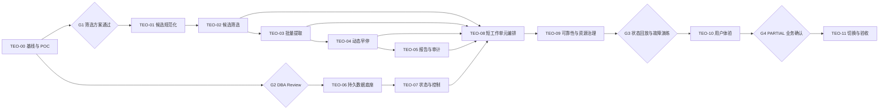

# 长耗时研究任务优化开发 WBS

> 文档状态：执行收口版（生产 No-Go）
> 版本：v1.7
> 日期：2026-07-22
> 上游设计：[长耗时研究任务执行优化设计方案](./TASK_EXECUTION_OPTIMIZATION_DESIGN.md)
> WBS 数量：91 个原子交付 + 4 个运行时降耗收口交付（TEO-12-01～12-04，定义见主升级 WBS）
> 当前状态：核心代码和隔离验证已基本完成，20/50 任务压测通过；候选筛选机器门禁仍为 `FAIL`，生产筛选保持关闭；整体仍为 `NO-GO_PENDING_FIRST_DEPLOYMENT_REVIEW`
> 本文用于后续逐个 WBS 开发、评审和验收，不包含本轮代码修改。

## 1. 使用方式

后续开发以 WBS ID 为唯一范围标识，例如：

```text
开发 TEO-02-03
```

收到某个 WBS 的开发指令后，执行顺序固定为：

1. 检查所有前置 WBS 是否已经验收。
2. 只读取该 WBS 关联的实现、测试和直接依赖文件。
3. 如果是修复现有 Bug，先提交能稳定复现问题的失败测试，再修改实现。
4. 本 WBS 修改文件不得超过 3 个；发现需要第 4 个文件时，停止并拆出新的 WBS。
5. 运行本 WBS 定向测试，再运行模块回归测试。
6. 列出边缘情况和建议测试用例，完成代码评审后才能标记 `DONE`。

状态定义：

| 状态 | 含义 |
| --- | --- |
| `NOT_STARTED` | 尚未开始 |
| `READY` | 前置依赖已完成，可以开发 |
| `IN_PROGRESS` | 正在开发，只允许一个负责人修改核心文件 |
| `REVIEW` | 代码和定向测试完成，等待评审/集成验证 |
| `DONE` | 验收标准全部通过 |
| `BLOCKED` | 外部条件或决策阻塞，必须记录原因 |

## 2. 开发硬约束

1. 不建设新旧执行引擎并行运行的兼容分支。
2. `backend/app/api/routes.py` 和 `backend/app/agents/nodes/` 属于冻结路径，不在本项目扩展。
3. PostgreSQL 是 Task、Run、工作单元、预算、事件和恢复状态的唯一事实源。
4. Redis 仅用于队列、快速租约、Provider 信号量和事件缓存；Redis 数据不得成为恢复或预算结算的唯一依据。
5. Celery 消息只触发短工作单元，不再承载完整数小时任务。
6. 模型输出不要求或保存隐藏 CoT，只保存结构化结果、原因码和简短摘要。
7. SSE/前端只展示已经校验并持久化的事件、Evidence 和章节快照。
8. 所有外部模型请求必须显式设置输出上限、严格网络截止时间和调用幂等键。
9. 所有任务状态变化必须通过状态机和命令服务，不允许 Agent、维度或页面直接写全局 Task 终态。
10. `COMPLETED` 只能在报告、引用关系和强制审计全部持久化后写入。

## 3. 目标模块边界

新增执行模块：

```text
backend/app/execution/
├── __init__.py
├── schemas.py                 # 状态、命令、执行视图 DTO
├── state_machine.py           # 纯状态转换
├── repository.py              # TaskRun / StageRun 持久化
├── asset_repository.py        # Candidate / Evidence 资产
├── budget_repository.py       # 预算预留与结算
├── event_repository.py        # 事件流
├── outbox_repository.py       # 事务 Outbox
├── command_service.py         # 暂停、继续、取消
├── query_service.py           # 用户可见执行视图
├── work_unit.py               # 可重入工作单元契约
├── orchestrator.py            # DAG 编排
├── research_stage.py          # 计划/搜索/筛选/抓取
├── extraction_stage.py        # 批量提取/充分性
├── report_stage.py            # 报告/引用/审计
├── external_call_service.py   # 外部调用账本与幂等
├── budget_service.py          # 预算门与降级
├── lease_service.py           # 动态租约与 fencing
├── recovery.py                # 心跳、对账、恢复
└── outbox_relay.py            # LISTEN/NOTIFY + 轮询 Relay
```

依赖方向：

```text
api → execution → agents / llm / tools / evidence
worker → execution
execution → db / config_center / services
llm 不得依赖 api
agents 不得直接写 Task 全局状态
```

## 4. 模块、门禁与交付波次

| 模块 | 内容 | WBS 数 | 主要交付 |
| --- | --- | ---: | --- |
| TEO-00 | 基线与筛选 POC | 17 | 可重复的基线、三轮协议演进和 G1 决策 |
| TEO-01 | 候选规范化 | 4 | 稳定 CandidateSet |
| TEO-02 | 长上下文候选筛选 | 5 | Single 全量评分卡与旁路影子诊断 |
| TEO-03 | 批量提取 | 6 | 6～10 条批提取和缺失项重试 |
| TEO-04 | 动态证据早停 | 4 | Skill evidence_policy 和信息增益 |
| TEO-05 | 报告与审计降噪 | 5 | 先落库、只审引用、批审计 |
| TEO-06 | 持久执行数据底座 | 9 | Run/Stage/Command/Event/Outbox 等 |
| TEO-07 | 状态机与控制 API | 7 | 暂停、继续、取消、查询 |
| TEO-08 | 短工作单元编排 | 8 | 可重入 DAG 和新 Worker |
| TEO-09 | 可靠性、预算与资源治理 | 10 | 超时、预算、租约、恢复、Relay |
| TEO-10 | 任务体验 | 8 | SSE、真实进度、控制和 PARTIAL UI |
| TEO-11 | 验证、切换与清理 | 8 | 回放、压测、故障演练、单路径切换 |
| **合计** |  | **91** |  |



当前门禁与交付状态：

| 范围 | 当前结论 | 对后续的约束 |
| --- | --- | --- |
| TEO-00 / G1 | 三样本 Schema 100%，但原门和临时门均 `FAIL`；业务裁决为 `MANUAL_CONDITIONAL_PASS` | 仅允许继续开发和影子验证；筛选结果不得改变候选集、抓取、提取或报告 |
| TEO-01～TEO-05 | 候选规范化、Single 影子筛选、批提取、证据策略及审计降噪代码完成 | 候选筛选与批提取仍需扩充样本和影子数据证明质量收益，不能把“代码完成”等同于“生产提速完成” |
| TEO-06 / G2 | `INTERNAL_APPROVED`，耐久执行全部并入单一绿色基线 001，并在独立 PostgreSQL 16 测试库完成双向验证 | 首次生产从空库部署；后续新领域迁移从 002 起连续编号 |
| TEO-07 | 01～05、07 已完成；07-06 的澄清问题/回答持久化并入 v3.2 澄清闭环 | 当前暂停/继续/取消可用；执行中澄清不得在 v3.2 验收前宣称完成 |
| TEO-08～TEO-10 | 短工作单元、状态账本、租约、Outbox、恢复、SSE 和真实进度完成隔离验证 | 首次生产部署仍受 Runbook 和最终验收约束 |
| TEO-11 / G3～G4 | 离线回放 15/15 通过；20/50 任务压测通过；100 任务按业务决定跳过；G4 已批准 | `TEO-11-08` 仍为 No-Go，待首次部署演练和正式发布评审 |

`MANUAL_CONDITIONAL_PASS` 不是 G1 机器质量通过，也不授权默认启用筛选。达到 10 个完成人工标注样本、50 个影子任务或裁决满 30 天任一条件后，必须重新评审 G1。

推荐发布波次：

- 波次 A：TEO-00～TEO-05，交付候选漏斗、批量提取和审计降噪。
- 波次 B：TEO-06～TEO-09，交付持久状态、暂停继续和异常恢复。
- 波次 C：TEO-10～TEO-11，交付真实进度、用户控制和首次生产部署。

## 5. 通用 Definition of Ready

每个 WBS 开始前必须满足：

- 前置 WBS 已为 `DONE`。
- 输入、输出和异常语义无待定项。
- 建议文件列表不超过 3 个。
- 测试 Fixture 可本地构造，不依赖不可控生产数据。
- 外部调用 WBS 已明确是否使用 Mock、录制响应或真实 API。
- 数据库 WBS 已确认 upgrade、downgrade 和锁影响。

## 6. 通用 Definition of Done

每个 WBS 完成必须满足：

- 实现没有新增兼容分支或绕过状态机的直接状态写入。
- 新增/修改逻辑有定向自动化测试。
- Bug 修复能够证明测试在修复前失败、修复后通过。
- 边缘情况、失败路径和幂等路径已测试。
- 日志不包含 Prompt 原文、访问令牌或未脱敏私有数据。
- 相关配置有默认值、上下限和启动校验。
- 定向测试通过；模块完成时模块回归通过。
- 数据库变更完成 upgrade → downgrade → upgrade 验证。
- 完成结果中列出实际修改文件、测试命令、边缘情况和遗留风险。

复杂度说明：`S=0.5～1 人日`，`M=1～2 人日`，`L=2～3 人日`；不含外部业务评审等待。

## 7. TEO-00：基线与筛选 POC

模块目标：把当前任务现象变成可重复指标，先证明 1×80、2×40、3×30 哪一种筛选模式满足质量门。

| ID | 原子交付 | 建议文件（≤3） | 依赖 | 验收标准 | 复杂度 |
| --- | --- | --- | --- | --- | --- |
| TEO-00-01 | 任务执行指标契约与当前链路埋点 | `backend/app/core/task_execution_metrics.py`<br>`backend/app/worker/harness_worker.py`<br>`backend/tests/test_task_execution_metrics.py` | 无 | 可按 task/run/stage 统计召回、入选、抓取、提取、接受、模型调用、Token、费用、延迟；不记录 Prompt 原文 | M |
| TEO-00-02 | 历史候选脱敏导出器 | `backend/scripts/export_task_screening_fixture.py`<br>`backend/tests/test_task_screening_fixture.py` | 00-01 | 能从指定任务导出 candidate_id/title/url/domain/snippet/source/date/金标引用；默认脱敏，不修改生产数据 | M |
| TEO-00-03 | Single/Chunked POC 运行器 | `backend/scripts/run_task_screening_poc.py`<br>`backend/tests/test_task_screening_poc.py` | 00-02 | 同一 Fixture 可运行 1×80、2×40+归并、3×30+归并和3个位置视图；输出 Recall@20、NDCG、Jaccard、Schema成功率、P90、Token、费用 | L |
| TEO-00-04 | 基线与 G1 决策报告 | `docs/TASK_EXECUTION_BASELINE.md`<br>`docs/TASK_EXECUTION_SCREENING_POC.md` | 00-03 | 写入当前任务和历史样本基线；明确生产 screening_mode、batch_size、top_k、Prompt版本；指标未达门不得进入02模块 | S |
| TEO-00-05 | Fixture v3 与全量业务标注校验 | `backend/scripts/export_task_screening_fixture.py`<br>`backend/tests/test_task_screening_fixture.py`<br>`docs/TASK_SCREENING_ANNOTATION_GUIDE.md` | 00-04 | Fixture不再将历史引用作为质量金标；全量五级标注、证据组、完成状态和uncertain占比可严格校验；v2被拒绝 | M |
| TEO-00-06 | Single全量评分卡与确定性Top20 | `backend/scripts/run_task_screening_poc.py`<br>`backend/tests/test_task_screening_poc.py` | 00-05 | 一次返回所有候选评分卡；缺失/重复/越界失败；程序固定排序；输出must-keep、证据组、精确率、Overlap、NDCG、费用及G1 | L |
| TEO-00-07 | 三样本评分卡复测与最终G1 | `docs/TASK_EXECUTION_SCREENING_POC.md`<br>`docs/TASK_EXECUTION_OPTIMIZATION_WBS.md` | 00-06 | 三个不同复杂度历史样本完成v3全量标注并独立复测；所有样本通过新G1后方可进入TEO-01/02 | M |
| TEO-00-08-01 | Fixture v5 候选身份归一化 | `backend/scripts/export_task_screening_fixture.py`<br>`backend/tests/test_task_screening_fixture.py`<br>`docs/TASK_SCREENING_ANNOTATION_GUIDE.md` | 00-07 | 非传递身份簇、代表候选、别名审计及严格v5校验完成；运行器拒绝v4 | M |
| TEO-00-08-02 | 三样本金标纠错与v4→v5一次性转换 | `backend/scripts/convert_task_screening_fixture_v5.py`<br>`backend/tests/test_task_screening_fixture_v5_conversion.py` | 08-01 | 冲突标签按固定优先级解决；目标主体/上级与外部分支口径一致；三份v5独立生成 | M |
| TEO-00-08-03 | 分解式评分卡与确定性角色派生 | `backend/scripts/run_task_screening_poc.py`<br>`backend/tests/test_task_screening_poc.py` | 08-02 | 主体×需求×证据形态×生命周期严格输出；组合冲突直接失败；不兼容旧协议 | L |
| TEO-00-08-04 | 角色诊断、集合稳定性与动态超时 | `backend/scripts/run_task_screening_poc.py`<br>`backend/tests/test_task_screening_poc.py` | 08-03 | 混淆矩阵、逐角色指标、位置角色一致性、selected_set_overlap及60/90/120秒动态超时完成 | M |
| TEO-00-08-05 | 三样本v5真实复测与G1报告 | `docs/TEO-00-G1-RETEST-RESULTS.md`<br>`docs/TASK_EXECUTION_OPTIMIZATION_WBS.md` | 08-04 | 三份独立审计生成；逐项记录G1；任一失败不降低门槛、不接入生产 | M |
| TEO-00-09-01 | 确定性主体关系派生 | `backend/scripts/run_task_screening_poc.py`<br>`backend/tests/test_task_screening_poc.py` | 08-05 | 标题优先解析指定主体、上级、其他分支/子公司与外部主体；输出可审计依据 | M |
| TEO-00-09-02 | 确定性证据形态与生命周期 | `backend/scripts/run_task_screening_poc.py`<br>`backend/tests/test_task_screening_poc.py` | 09-01 | 采购文书、案例、运营信号和带年份截止日期由程序派生；历史日期不再被模型标为active | M |
| TEO-00-09-03 | 精简模型协议 v6 | `backend/scripts/run_task_screening_poc.py`<br>`backend/tests/test_task_screening_poc.py` | 09-02 | 模型仅输出需求关系与两个质量分；完整评分卡由程序派生；拒绝旧字段 | L |
| TEO-00-09-04 | 原 G1 与临时推进门 | `backend/scripts/run_task_screening_poc.py`<br>`backend/tests/test_task_screening_poc.py` | 09-03 | 同时输出原门、临时门和决策；临时门仅可授权开发与影子模式 | M |
| TEO-00-09-05 | v6 三样本真实复测与决策 | `docs/TEO-00-G1-RETEST-RESULTS.md`<br>`docs/TASK_EXECUTION_OPTIMIZATION_WBS.md` | 09-04 | 三份独立v6审计完成；原门和临时门均为FAIL，不启用筛选接入 | M |

当前状态：`TEO-00-09-01`～`TEO-00-09-05` 已完成开发与三样本真实复测。Fixture v5 原始候选 246 条归一化为 195 条代表候选；v6 三样本 Schema 均为100%，但原 G1 与临时推进门均未通过，三份审计继续保持 `FAIL`。业务方因样本数量不足、为避免阻塞整体建设，作出 `MANUAL_CONDITIONAL_PASS`：解除 TEO-01、TEO-02 及后续 WBS 的开发和旁路影子验证依赖，但生产筛选默认关闭，影子结果不得改变用户候选集、抓取/提取输入或报告。10 个标注样本、50 个影子任务或裁决满30天任一触发后重新评审。模型计费单价仍未配置，仅影响费用审计完整性，不影响质量结论。详见 `docs/TEO-00-G1-RETEST-RESULTS.md`。

模块测试：

```powershell
Set-Location backend
pytest tests/test_task_execution_metrics.py tests/test_task_screening_fixture.py tests/test_task_screening_poc.py -q
```

## 8. TEO-01：候选规范化

模块目标：让候选从临时 SearchResult 变成有稳定 ID、可去重、可复现排序的 CandidateSet。

| ID | 原子交付 | 建议文件（≤3） | 依赖 | 验收标准 | 复杂度 |
| --- | --- | --- | --- | --- | --- |
| TEO-01-01 | Candidate 数据契约与稳定 ID | `backend/app/agents/schemas/candidate_schema.py`<br>`backend/app/agents/harness/state.py`<br>`backend/tests/test_candidate_pipeline.py` | 00-07 | Candidate 含固定字段和 `candidate_id`；ID由规范化 URL/内容来源生成，同输入同版本结果稳定 | M |
| TEO-01-02 | URL 规范化和确定性去重 | `backend/app/agents/harness/candidate_pipeline.py`<br>`backend/tests/test_candidate_pipeline.py` | 01-01 | 去除追踪参数、片段和无意义尾斜杠；保留语义参数；重复 URL/标题按规则合并且来源可追踪 | M |
| TEO-01-03 | 确定性分层交错排序 | `backend/app/agents/harness/candidate_pipeline.py`<br>`backend/tests/test_candidate_pipeline.py` | 01-02 | 按来源、查询、原排名分位、日期交错；相同 seed 可复现；头中尾位置都有不同来源 | M |
| TEO-01-04 | ResearchAgent 接入 CandidateSet | `backend/app/agents/agents/research_agent.py`<br>`backend/app/agents/harness/agent_harness.py`<br>`backend/tests/test_harness_candidate_pipeline.py` | 01-03 | 单次搜索同时形成 CandidateSet 与影子期基线结果；候选数、去重数和来源分布进入安全指标；现有抓取/提取输入保持不变，基线字段在03-06切换后移除 | L |

当前状态：`TEO-01-01`～`TEO-01-04` 已完成，CandidateSet 已接入 ResearchAgent 和 Harness 影子链路。当前 Extraction 仍只读取基线 SearchResult，候选指标不记录查询文本、标题、URL、Prompt 或摘要，生产用户结果未改变。后续候选筛选进展详见 TEO-02 当前状态。

## 9. TEO-02：长上下文候选筛选

模块目标：在不改变用户结果的前提下，把65～80条候选旁路送入一次 Single 全量筛选，严格记录评分卡、位置诊断和失败审计；Chunked 与 Auto 暂不开发。

| ID | 原子交付 | 建议文件（≤3） | 依赖 | 验收标准 | 复杂度 |
| --- | --- | --- | --- | --- | --- |
| TEO-02-01 | Single筛选配置与v6 Prompt | `backend/app/config_center/research_config.py`<br>`backend/app/agents/prompts/candidate_screening.md`<br>`backend/tests/test_candidate_screening.py` | 01-04 | 仅配置single、top_k、seed、动态超时和Token软提示；Prompt采用v6精简评分卡且不传人工标签、不要求CoT | M |
| TEO-02-02 | Single 全量筛选服务 | `backend/app/agents/agents/candidate_screening_agent.py`<br>`backend/tests/test_candidate_screening.py` | 02-01 | 一次输入全部紧凑候选；模型仅返回candidate_id、demand_relation、source_quality、novelty；确定性派生事实、角色、相关性和Top≤20 | L |
| TEO-02-03 | Single影子运行与位置诊断 | `backend/app/agents/agents/candidate_screening_agent.py`<br>`backend/tests/test_candidate_screening.py` | 02-02 | 三位置视图仅用于影子诊断；输出selected_set_overlap、角色一致率和不一致候选，不实现Chunked、Auto或投票生产策略 | L |
| TEO-02-04 | 严格结构校验与失败审计 | `backend/app/agents/agents/candidate_screening_agent.py`<br>`backend/app/agents/schemas/candidate_schema.py`<br>`backend/tests/test_candidate_screening.py` | 02-03 | 漏ID、重复/未知ID、多余字段、非法枚举/分数和JSON截断全部硬失败；保存失败审计，不兼容旧协议、不静默补偿 | L |
| TEO-02-05 | Harness影子集成与漏斗指标 | `backend/app/agents/harness/agent_harness.py`<br>`backend/app/core/task_execution_metrics.py`<br>`backend/tests/test_harness_candidate_screening.py` | 02-04 | 基线与筛选结果同时记录；筛选结果不改变抓取/提取输入或用户报告；生产开关默认关闭 | L |

当前状态：`TEO-02-01`～`TEO-02-05` 已完成。Single 全量评分卡服务、三位置影子诊断和失败审计均可用；`shadow_enabled=false` 为默认值，只有配置中心显式开启才会旁路调用模型。无论成功、Schema 失败或外部调用失败，基线 SearchResult、抓取、Extraction 和用户报告均不改变。`TEO-03-01` 已转为 `READY`。

## 10. TEO-03：批量提取与选择性抓取

模块目标：正文只抓 Top 12～20，详细提取按6～10条一批，失败只重试缺失项。

| ID | 原子交付 | 建议文件（≤3） | 依赖 | 验收标准 | 复杂度 |
| --- | --- | --- | --- | --- | --- |
| TEO-03-01 | 批提取 Schema 与 Prompt | `backend/app/agents/schemas/batch_extraction_schema.py`<br>`backend/app/agents/prompts/batch_extraction.md`<br>`backend/tests/test_extractor_batch.py` | 02-05 | 顶层固定 `items`；每项有candidate_id、字段、引用片段、可信度、拒绝原因；限制单项字数 | M |
| TEO-03-02 | Token 感知批次规划器 | `backend/app/agents/harness/extraction_batch.py`<br>`backend/tests/test_extractor_batch.py` | 03-01 | 默认6～10条；输入不超过上下文30%、硬上限50%；输出估算不超过最大输出60%；可自动缩批 | M |
| TEO-03-03 | ExtractorAgent 批量执行 | `backend/app/agents/agents/extractor_agent.py`<br>`backend/tests/test_extractor_batch.py` | 03-02 | 每批仅一次模型调用；强制max_output_tokens；输出按candidate_id映射；不按数组位置匹配 | L |
| TEO-03-04 | 缺失项/非法项最小重试 | `backend/app/agents/agents/extractor_agent.py`<br>`backend/app/agents/schemas/batch_extraction_schema.py`<br>`backend/tests/test_extractor_batch.py` | 03-03 | 成功项不重做；仅缺失/非法ID进入下一小批；达到重试上限后明确拒绝原因 | M |
| TEO-03-05 | Top候选选择性抓取与候补补位 | `backend/app/agents/agents/research_agent.py`<br>`backend/app/agents/harness/candidate_pipeline.py`<br>`backend/tests/test_research_selective_fetch.py` | 02-05 | 只抓Top 12～20；抓取失败按排名补位；静态/Playwright失败可降级snippet并降低可信度 | L |
| TEO-03-06 | Harness 批提取集成和真实批次进度 | `backend/app/agents/harness/agent_harness.py`<br>`backend/app/agents/agents/extractor_agent.py`<br>`backend/tests/test_harness_batch_extraction.py` | 03-04,03-05 | 进度显示批次m/n；65候选场景候选处理调用≤G1上限；证据与candidate_id可追溯 | L |

当前状态：`TEO-03-01`～`TEO-03-06` 已完成。批提取 v1 的 `items` 契约、单项文本限制和 Token 感知 6～10 条规划器已就绪；每个规划批次只发起一次模型调用，响应严格按 `candidate_id` 映射。漏返项和能定位的非法项只会进入下一最小批，成功项绝不重做；不能安全归属的根结构、未知 ID 与截断响应仍直接失败。选择性抓取默认只追求 12 条完整正文、最多尝试 20 条，失败时按排序启用候补并保留低置信度摘要。Harness 已接入显式影子开关、批次 `m/n` 进度和候选 ID 可追溯影子证据；默认关闭，基线提取和用户报告保持不变。`TEO-04-01` 已转为 `READY`。

## 11. TEO-04：Skill 动态证据与信息增益

模块目标：不再固定5条或处理全部候选，由Skill明确最小、目标、最大证据和交叉验证标准。

| ID | 原子交付 | 建议文件（≤3） | 依赖 | 验收标准 | 复杂度 |
| --- | --- | --- | --- | --- | --- |
| TEO-04-01 | evidence_policy Schema 与解析 | `backend/app/skills/schema.py`<br>`backend/app/skills/registry.py`<br>`backend/tests/test_skill_registry.py` | 03-06 | 支持min/target/max、域名数、可信来源数、关键Claim支持数、低增益批次上限；非法配置启动即失败 | M |
| TEO-04-02 | 内置 Skill 证据策略 | `backend/app/skills/seed_data.py`<br>`backend/tests/test_skill_registry.py` | 04-01 | 每个内置Skill有明确策略；简单任务与深度任务阈值不同；种子重复执行幂等 | M |
| TEO-04-03 | 充分性与信息增益评估器 | `backend/app/agents/eval/evidence_sufficiency.py`<br>`backend/tests/test_evidence_sufficiency.py` | 04-01 | 计算字段、Claim、来源、事实簇、新颖度、重复率；关键缺口存在时不得低增益早停 | L |
| TEO-04-04 | Harness 早停与候补扩展 | `backend/app/agents/harness/agent_harness.py`<br>`backend/app/agents/eval/evidence_sufficiency.py`<br>`backend/tests/test_harness_evidence_policy.py` | 04-02,04-03 | 达标立即停止；连续两批低增益且无关键缺口时停止；不足时按梯队扩展而非全量处理 | L |

当前状态：`TEO-04-01`～`TEO-04-04` 已完成。`EvidencePolicy` 已严格定义最小/目标/最大证据数、来源和关键 Claim 门槛、低增益批次上限；配置缺失、额外字段或阈值冲突均在注册解析时失败。六个内置 Skill 均有随研究深度变化的策略，种子数据重复加载不改变既有幂等写入机制。充分性评估器已计算字段、Claim、来源、事实簇、新颖度与重复率；关键缺口存在时不得因低增益停止。Harness 在显式传入策略时按梯队提取，达到目标证据数或满足无缺口低增益停止条件即停止；未传策略时保持原有全量基线路径。`TEO-05-01` 已转为 `READY`。

## 12. TEO-05：报告与审计降噪

模块目标：Evidence先获得稳定ID，只审报告实际引用的证据和关键Claim，取消全量逐条审计。

| ID | 原子交付 | 建议文件（≤3） | 依赖 | 验收标准 | 复杂度 |
| --- | --- | --- | --- | --- | --- |
| TEO-05-01 | 空 Evidence UUID 审计 Bug 复现与修复 | `backend/tests/test_audit.py`<br>`backend/app/worker/harness_worker.py` | 04-04 | 先新增失败测试复现空ID/UUID校验异常；修复后审计不会在落库前执行 | M |
| TEO-05-02 | Evidence 落库优先和审计输入契约 | `backend/app/worker/harness_worker.py`<br>`backend/app/agents/audit_persistence.py`<br>`backend/tests/test_audit.py` | 05-01 | Evidence事务提交并取得UUID后才构造审计输入；失败回滚不产生孤儿审计 | L |
| TEO-05-03 | 引用证据选择器和报告最小上下文 | `backend/app/agents/audit_selection.py`<br>`backend/app/agents/claim_reference_validator.py`<br>`backend/tests/test_audit_selection.py` | 05-02 | 只返回报告引用Evidence、关键Claim和冲突项；未引用搜索噪声不进入模型审计/报告Prompt | M |
| TEO-05-04 | 引用证据批量审计 | `backend/app/agents/agents/auditor_agent.py`<br>`backend/app/agents/prompts/auditor.md`<br>`backend/tests/test_audit.py` | 05-03 | 只对引用证据和关键Claim小批审计；输出按Evidence ID校验；强制审计失败不能COMPLETED | L |
| TEO-05-05 | 当前多维任务完成语义修正 | `backend/app/worker/harness_worker.py`<br>`backend/app/api/task_store.py`<br>`backend/tests/test_worker_harness.py` | 05-02 | 维度完成不写Task COMPLETED/finished_at；仅报告及强制审计完成后写终态；先写复现测试 | L |

当前状态：`TEO-05-01`～`TEO-05-05` 已完成。审计管线入口会拒绝缺少 Evidence UUID 的输入，避免空 UUID 进入模型审计或后续校验；审计持久化层会验证每个 UUID 对应的 Evidence 行已存在，失败时不创建孤儿审计记录。引用选择器只返回报告引用 Evidence、关键 Claim 和冲突项，不让未引用搜索噪声或正文进入审计/报告最小上下文。Worker 对选中 Evidence 每批最多 8 条执行严格批审计，响应 ID 不匹配、截断或报告缺失引用均会阻断审计完成。单维结果只更新过程状态，只有报告和必要审计成功后才统一写入任务完成终态。

## 13. TEO-06：持久执行数据底座

模块目标：建立PostgreSQL执行账本，为暂停、恢复、幂等和Outbox提供数据基础。

### 13.1 G2 DBA Review

开始迁移前必须确认：状态列类型、`bytea` SHA-256、全局幂等注册表、时间分区唯一约束、部分索引、预算条件更新锁粒度、归档周期、迁移锁和回滚策略。

| ID | 原子交付 | 建议文件（≤3） | 依赖 | 验收标准 | 复杂度 |
| --- | --- | --- | --- | --- | --- |
| TEO-06-00 | execution 模块登记与边界 | `backend/app/execution/__init__.py`<br>`docs/V3_MODULE_BOUNDARIES.md` | G2 | 文档明确execution依赖方向；禁止agents直接写Task全局状态；模块可被测试导入 | S |
| TEO-06-01 | 单一绿色数据库基线 | `backend/app/db/models.py`<br>`backend/migrations/versions/001_greenfield_baseline.py`<br>`backend/tests/test_greenfield_baseline.py` | 06-00 | 一次创建当前全部 72 张 ORM 表；TaskRun/StageRun/Command/Outbox 等约束完整；不存在历史回填或旧结构 | L |
| TEO-06-02 | Alembic 唯一建库入口 | `backend/app/db/session.py`<br>`backend/main.py`<br>`backend/tests/test_db_bootstrap.py` | 06-01 | 应用启动不调用 `create_all`；Backend 是唯一迁移所有者；Worker/Relay 只等待健康状态 | L |
| TEO-06-03 | Schema 与系统初始化分离 | `backend/app/db/init_data.py`<br>`backend/app/skills/runtime_catalog.py`<br>`backend/tests/test_db_bootstrap.py` | 06-02 | 迁移只建 Schema；初始化服务幂等创建获批配置；标准 `SKILL.md` 是唯一 Skill 运行时来源 | M |
| TEO-06-04 | 绿色基线往返验证器 | `backend/scripts/verify_greenfield_migration.py`<br>`backend/migrations/versions/001_greenfield_baseline.py`<br>`backend/tests/test_greenfield_baseline.py` | 06-03 | 自动验证 `upgrade → check → downgrade → upgrade → check`；降级后无业务表和 Enum 残留 | L |
| TEO-06-05 | TaskRun/StageRun Repository | `backend/app/execution/repository.py`<br>`backend/tests/test_execution_repository.py` | 06-04 | 支持CAS、generation、unit完成事务、下一个未完成单元查询；并发更新只有一个成功 | L |
| TEO-06-06 | Candidate/调用/预算 Repository | `backend/app/execution/asset_repository.py`<br>`backend/app/execution/budget_repository.py`<br>`backend/tests/test_execution_asset_repository.py` | 06-03 | Candidate/Evidence幂等写；调用键防重；预算条件预留和退还；Redis不参与最终断言 | L |
| TEO-06-07 | TaskEvent/Outbox Repository | `backend/app/execution/event_repository.py`<br>`backend/app/execution/outbox_repository.py`<br>`backend/tests/test_execution_event_repository.py` | 06-04 | 业务变更、事件和Outbox同事务；多个领取者使用SKIP LOCKED不重复拥有同一行 | L |
| TEO-06-08 | 审计复用键持久化接入 | `backend/app/agents/audit_persistence.py`<br>`backend/tests/test_audit.py` | 05-04,06-03 | 相同content_hash/policy/model直接复用；内容或策略版本变化才重审；重复投递不新增审计记录 | M |

当前状态：`TEO-06-00`～`TEO-06-08` 已完成，G2 已按 `INTERNAL_APPROVED` 通过。Backend 是唯一迁移和种子初始化所有者；Alembic 使用 advisory lock 和受限 DDL 超时；服务连接池理论上限为47。耐久执行涉及的 TaskRun、StageRun、Command、Candidate、ExternalCall、预算账本、TaskEvent 和 Outbox 均已并入唯一根迁移 `001_greenfield_baseline.py`，该迁移覆盖当前 72 张 ORM 表，并通过 `upgrade → check → downgrade → upgrade → check` 验证；降级后无业务表和原生 Enum 残留。TEO-06-05 已验证 generation 创建、control_version CAS、租约 epoch 提交保护和未完成单元稳定排序；两个竞争更新中仅一个成功。TEO-06-06、06-07 已补齐资产、预算、事件和 Outbox Repository；TEO-06-08 已接入正文哈希、策略指纹与实际模型版本三元复用：无完整元数据时保留审计但不复用，跨 Evidence 时物化结果到当前 Evidence，并发竞争收敛为单一规范复用键；审计持久化失败会直接终止任务流水线。首次生产环境从空库直接部署该唯一链路，不执行旧迁移、不回填历史数据。详见 `docs/G2_DBA_REVIEW_DECISION.md`。

数据库验收命令：

```powershell
Set-Location backend
alembic upgrade head
alembic downgrade -1
alembic upgrade head
pytest tests/test_migration_013.py tests/test_migration_014.py tests/test_migration_015.py tests/test_migration_016.py -q
```

## 14. TEO-07：状态机与任务控制

模块目标：统一Task全局状态所有权，提供幂等暂停、继续、取消、澄清和查询能力。

| ID | 原子交付 | 建议文件（≤3） | 依赖 | 验收标准 | 复杂度 |
| --- | --- | --- | --- | --- | --- |
| TEO-07-01 | 状态/命令Schema与纯状态机 | `backend/app/execution/schemas.py`<br>`backend/app/execution/state_machine.py`<br>`backend/tests/test_execution_state_machine.py` | 06-05 | 覆盖PENDING/QUEUED/RUNNING/PAUSING/PAUSED/WAITING_FOR_INPUT/RECOVERING/CANCELLING/终态；非法迁移拒绝 | L |
| TEO-07-02 | 幂等命令服务与control_version CAS | `backend/app/execution/command_service.py`<br>`backend/app/execution/repository.py`<br>`backend/tests/test_execution_commands.py` | 07-01 | 相同幂等键返回首次结果；并发pause/resume以最高control_version为准；只创建一个generation | L |
| TEO-07-03 | pause/resume/cancel 业务语义 | `backend/app/execution/command_service.py`<br>`backend/tests/test_execution_commands.py` | 07-02 | pause立即改desired_state；resume仅允许PAUSED/WAITING_FOR_INPUT；cancel不可恢复；重复命令无副作用 | L |
| TEO-07-04 | 用户可见执行查询服务 | `backend/app/execution/query_service.py`<br>`backend/tests/test_execution_query.py` | 06-07,07-01 | 聚合状态、阶段、维度、批次、剩余工作、预算、心跳、最近持久点、恢复次数和ETA区间 | M |
| TEO-07-05 | 控制/查询 API 与权限 | `backend/app/api/task_execution_routes.py`<br>`backend/main.py`<br>`backend/tests/test_api_task_execution.py` | 07-03,07-04 | pause/resume/cancel返回202；非法迁移409；重复命令幂等；跨用户/Workspace返回404 | L |
| TEO-07-06 | 待澄清暂停与回答恢复 | `backend/app/agents/harness/human_intervention.py`<br>`backend/app/execution/command_service.py`<br>`backend/tests/test_clarification_resume.py` | 07-03 | 问题和回答先落库；等待期无付费调用；部分回答保持等待；同一回答只恢复一次 | L |
| TEO-07-07 | 批量任务单行暂停语义 | `backend/app/worker/batch_worker.py`<br>`backend/app/api/batch_store.py`<br>`backend/tests/test_batch_scheduling.py` | 07-03 | 只暂停受影响Task；其他行继续；Batch汇总区分运行、暂停、部分完成；不占Worker轮询等待 | L |

当前状态：`TEO-07-01`～`TEO-07-05` 已完成。执行域已定义强类型的 desired/observed 状态、命令与观察事件；纯状态机已覆盖入队、运行、协作暂停、待澄清、恢复、取消、完成、失败与部分完成，终态不可逆且非法迁移直接拒绝。命令服务已通过 `(task_id, idempotency_key)` 保证重复提交返回首次结果，并以 Task 行锁后 CAS 避免外键共享锁与控制更新锁的并发死锁；两个恢复命令竞争同一控制版本时仅一个成功，且只创建一个 Run generation。暂停会立即更新 desired_state 并进入协作暂停，恢复仅允许 PAUSED/WAITING_FOR_INPUT，取消后不可恢复；不同请求键的重复暂停或取消不再递增版本。用户可见查询已从持久表聚合活动 Run、阶段/维度进度、剩余工作、预算账本、心跳、检查点、恢复次数和 P50/P90 ETA；没有完成单元时 ETA 明确未知。控制与查询 API 已接入，成功返回 202、非法迁移返回 409，且对跨用户任务统一返回 404。`TEO-07-06` 已转为 `READY`。

补充状态：`TEO-07-07` 已完成。批调度仅派发 `PENDING + desired_state=RUNNING` 的行；单任务暂停不会阻塞同批次其他任务，也不会在 Worker 中轮询等待，批次读取摘要新增 `paused_tasks`。`TEO-07-06` 仍未完成，其问题/回答持久化、等待期零外部调用和回答后幂等恢复并入总升级 WBS 的 v3.2 澄清闭环，不作为当前执行底座已经交付的能力。

## 15. TEO-08：短工作单元编排

模块目标：把单体多小时Harness拆成可重入、可跳过、可单元重试的DAG。

| ID | 原子交付 | 建议文件（≤3） | 依赖 | 验收标准 | 复杂度 |
| --- | --- | --- | --- | --- | --- |
| TEO-08-01 | WorkUnit契约、unit_key和DAG | `backend/app/execution/work_unit.py`<br>`backend/tests/test_execution_work_unit.py` | 07-01 | 单元含输入哈希、依赖、attempt、deadline、预算预估；同输入生成稳定unit_key；循环依赖拒绝 | L |
| TEO-08-02 | 可重入编排器 | `backend/app/execution/orchestrator.py`<br>`backend/app/execution/repository.py`<br>`backend/tests/test_execution_orchestrator.py` | 08-01,07-03 | 只调度依赖完成单元；已完成跳过；单事务提交产物/状态/事件/下一Outbox | L |
| TEO-08-03 | 计划、搜索、筛选、抓取阶段处理器 | `backend/app/execution/research_stage.py`<br>`backend/app/agents/agents/candidate_screening_agent.py`<br>`backend/tests/test_execution_research_stage.py` | 02-05,03-05,08-02 | 每个阶段可独立重试；研究资产落库；候选筛选和抓取不依赖内存前序对象 | L |
| TEO-08-04 | 批提取与充分性阶段处理器 | `backend/app/execution/extraction_stage.py`<br>`backend/app/agents/eval/evidence_sufficiency.py`<br>`backend/tests/test_execution_extraction_stage.py` | 03-06,04-04,08-02 | 一批一个工作单元；成功批不重做；早停/扩展写明确事件；Evidence幂等落库 | L |
| TEO-08-05 | 报告、引用和审计阶段处理器 | `backend/app/execution/report_stage.py`<br>`backend/app/agents/audit_selection.py`<br>`backend/tests/test_execution_report_stage.py` | 05-04,06-08,08-02 | 报告只用已选Evidence；引用先落库；强制审计完成后才允许COMPLETED；失败可形成明确PARTIAL | L |
| TEO-08-06 | 安全暂停点与真实进度事件 | `backend/app/execution/orchestrator.py`<br>`backend/app/execution/event_repository.py`<br>`backend/tests/test_execution_pause_boundary.py` | 08-03,08-04,08-05 | 每次外部调用前/批次后/阶段前检查desired_state；PAUSING不发新调用；进度单调且基于工作单元 | L |
| TEO-08-07 | 新 Celery 工作单元入口 | `backend/app/worker/execution_worker.py`<br>`backend/app/execution/orchestrator.py`<br>`backend/tests/test_execution_worker.py` | 08-06 | Celery消息只含task/run/unit标识；Worker加载DB状态；单元提交后ack；重复消息直接确认已完成 | L |
| TEO-08-08 | 生产任务创建绑定唯一编排器 | `backend/app/worker/harness_worker.py`<br>`backend/app/worker/execution_worker.py`<br>`backend/tests/test_worker_harness.py` | 08-07 | 新任务只进入耐久执行路径；不存在旧引擎、双轨开关或任务排空逻辑 | L |

当前状态：`TEO-08-01` 至 `TEO-08-05` 已完成。已交付不可变 `WorkUnit` 契约（输入哈希、依赖、尝试次数、截止时间、预算预估）、稳定 `unit_key`、依赖校验和确定性拓扑排序；循环依赖与未知依赖均会在编排前被拒绝。编排器仅投递依赖已完成的单元，并以同一事务提交产物、状态、事件和后继 Outbox。研究阶段处理器只依赖持久化资产：计划查询词、ResearchCandidate、筛选结果和正文快照，阶段重试不复用 Harness 内存对象。批提取按单批工作单元执行，以确定性 Evidence ID 幂等落库，并显式写入充分性、早停或扩展事件。报告阶段仅接收已选 Evidence，先持久化引用关系后执行强制审计；模型或 Schema 审计失败形成明确 `PARTIAL`，审计持久化失败则向上抛出。`TEO-08-06` 已具备启动条件。

2026-07-22 状态校准：`TEO-08-06`～`TEO-08-08` 已完成代码与隔离测试。安全暂停点会在外部调用前、批次提交后和阶段边界检查 `desired_state`；Celery 工作单元消息只携带持久化标识并由 Worker 回读数据库；任务创建入口仅创建耐久运行并投递工作单元。项目无生产旧任务，首次部署不包含排空或双轨切换。

## 16. TEO-09：可靠性、预算与资源治理

模块目标：保证调用有物理上限、预算不超扣、Worker不脑裂、消息不丢失、异常可恢复。

| ID | 原子交付 | 建议文件（≤3） | 依赖 | 验收标准 | 复杂度 |
| --- | --- | --- | --- | --- | --- |
| TEO-09-01 | Gateway输出上限和严格网络截止 | `backend/app/llm/gateway_client.py`<br>`backend/tests/test_gateway_client.py` | 03-03 | 每次调用必须有max_tokens映射；connect/pool/write/read/总deadline生效；缺少Provider映射时调用前失败 | L |
| TEO-09-02 | 外部调用账本与幂等包装 | `backend/app/execution/external_call_service.py`<br>`backend/app/llm/gateway_client.py`<br>`backend/tests/test_external_call_service.py` | 06-06,09-01 | 调用前STARTED；返回后结算；相同幂等键复用；崩溃窗口标记billing_outcome=UNKNOWN | L |
| TEO-09-03 | PostgreSQL预算记账、结算和退还 | `backend/app/execution/budget_service.py`<br>`backend/app/execution/budget_repository.py`<br>`backend/tests/test_execution_budget.py` | 06-06,09-02 | 原子累计预留和结算；按任务/维度分行；并发账本不丢失；usage返回后退差额；超额仅告警 | L |
| TEO-09-04 | 80/95/100预算告警与PARTIAL策略 | `backend/app/execution/budget_service.py`<br>`backend/app/skills/registry.py`<br>`backend/tests/test_execution_budget.py` | 04-01,09-03 | 80/95/100展示分级提示；不得禁止新调用或降低强制质量门；PARTIAL仅按Skill和证据充分性决定 | L |
| TEO-09-05 | Provider分布式信号量真正生效 | `backend/app/services/provider_semaphore.py`<br>`backend/app/llm/gateway_client.py`<br>`backend/tests/test_provider_semaphore.py` | 09-02 | 所有模型调用必须获取令牌；只计算启用健康Provider；并发不超过配置；异常释放令牌 | L |
| TEO-09-06 | Celery late-ack/prefetch/visibility配置 | `backend/app/worker/celery_app.py`<br>`backend/tests/test_celery_execution_config.py` | 08-07 | prefetch=1；三个visibility配置一致且≥max(900,3×P99单元)；启动自检失败则拒绝Worker启动 | M |
| TEO-09-07 | 动态租约与lease_epoch fencing | `backend/app/execution/lease_service.py`<br>`backend/app/execution/repository.py`<br>`backend/tests/test_execution_lease.py` | 06-05,08-07 | TTL按P99+60秒并限90～300秒；CAS获得新epoch；旧epoch不能发新调用或提交结果 | L |
| TEO-09-08 | 心跳、异常分类和恢复对账器 | `backend/app/execution/recovery.py`<br>`backend/app/worker/execution_worker.py`<br>`backend/tests/test_execution_recovery.py` | 09-07 | 心跳与租约解耦；过期Run按desired_state收敛；技术错误最多3次；业务/预算/权限错误不盲重试 | L |
| TEO-09-09 | Outbox混合Relay | `backend/app/execution/outbox_relay.py`<br>`backend/app/execution/outbox_repository.py`<br>`backend/tests/test_outbox_relay.py` | 06-07 | LISTEN/NOTIFY唤醒；2秒轮询兜底；SKIP LOCKED批量100；发布后标记；通知丢失仍≤5秒投递 | L |
| TEO-09-10 | Relay进程与健康检查部署 | `docker-compose.yml`<br>`docker-compose.prod.yml`<br>`backend/tests/test_outbox_relay_deployment.py` | 09-09 | 独立Relay进程可启动、重连、优雅停止；健康检查覆盖监听和最近成功投递；不与Worker共用阻塞循环 | M |

当前状态：`TEO-09-01`～`TEO-09-10` 已完成代码与隔离测试收口。Gateway 对同步调用强制输出上限与网络截止；外部调用在物理请求前写入账本，崩溃窗口保留 UNKNOWN；预算预留、结算、退还和超额告警均为不可变记录且不拦截质量调用。Worker 使用 late-ack、prefetch=1、动态 fencing 租约和独立心跳续租；Outbox Relay 采用 PostgreSQL LISTEN/NOTIFY 加 2 秒轮询，独立进程具备重连和健康检查。首次生产部署仍受 G3/G4 和发布门禁约束。

## 17. TEO-10：任务控制与可见体验

模块目标：用户看到真实工作量、可暂停继续、可感知恢复，并且页面刷新后状态不丢失。

| ID | 原子交付 | 建议文件（≤3） | 依赖 | 验收标准 | 复杂度 |
| --- | --- | --- | --- | --- | --- |
| TEO-10-01 | Durable Event查询和SSE接口 | `backend/app/api/task_execution_routes.py`<br>`backend/app/execution/query_service.py`<br>`backend/tests/test_api_task_execution_events.py` | 07-05,09-09 | 支持after_sequence/Last-Event-ID；断线可补历史；仅返回任务所有者事件；不推原始模型Token | L |
| TEO-10-02 | 前端执行类型与API客户端 | `frontend/src/lib/task-execution.ts` | 10-01 | 类型覆盖全部状态、命令、工作量、预算、事件、PARTIAL；错误映射区分409/404/网络失败 | M |
| TEO-10-03 | SSE重连与事件归并 Hook | `frontend/src/lib/use-task-events.ts`<br>`frontend/src/lib/task-execution.ts`<br>`frontend/e2e/task-execution.spec.ts` | 10-02 | 自动带last sequence重连；事件按sequence去重；断线回退查询；卸载时释放连接 | M |
| TEO-10-04 | 暂停/继续/取消控制组件 | `frontend/src/app/components/task-execution-controls.tsx`<br>`frontend/src/app/tasks/[id]/page.tsx`<br>`frontend/e2e/task-execution.spec.ts` | 07-05,10-03 | PAUSING显示等待当前调用；重复点击不会重复命令；非法状态按钮禁用；取消二次确认 | L |
| TEO-10-05 | 真实进度和剩余工作组件 | `frontend/src/app/components/task-execution-progress.tsx`<br>`frontend/src/app/tasks/[id]/page.tsx`<br>`frontend/e2e/task-execution.spec.ts` | 08-06,10-03 | 显示维度、阶段、批次、剩余候选、最近持久点；进度不回退；ETA不可信时隐藏 | L |
| TEO-10-06 | PARTIAL/恢复/预算状态组件 | `frontend/src/app/components/task-execution-status.tsx`<br>`frontend/src/app/tasks/[id]/page.tsx`<br>`frontend/e2e/task-execution.spec.ts` | 09-04,10-03 | PARTIAL明确缺口；RECOVERING显示恢复点和次数；预算等待展示续跑预计成本，不冒充完成 | L |
| TEO-10-07 | 任务页移除假进度和旧状态源 | `frontend/src/app/tasks/[id]/page.tsx`<br>`frontend/src/app/components/harness-viz.tsx`<br>`frontend/e2e/task-execution.spec.ts` | 10-04,10-05,10-06 | 移除+2%模拟增长；页面只使用durable execution view/events；刷新和断网恢复一致 | L |
| TEO-10-08 | 批量任务暂停行和汇总体验 | `frontend/src/app/components/batch-progress.tsx`<br>`frontend/e2e/task-execution.spec.ts` | 07-07,10-06 | 批次显示暂停/运行/部分完成行数；单行暂停不冻结整批；可跳转到任务继续处理 | M |

当前状态：`TEO-10-01`～`TEO-10-07` 已完成基础切换。后端提供可按 sequence 补偿的 durable 事件查询和 SSE；前端使用携带 Bearer Header 的 fetch 流消费 SSE，避免在 URL 中传递访问令牌。任务页已接入 durable 控制版本、暂停/继续/取消、真实工作单元进度、恢复和预算审计状态；旧任务 WebSocket、Harness 路由及 Harness 可视化组件均不再注册或使用。`TEO-10-08` 的批量行级体验待与批量执行路径统一后完成。

前端验收命令：

```powershell
Set-Location frontend
npm run build
npm run test:e2e -- task-execution.spec.ts
```

2026-07-18 状态校准：`TEO-10-08` 已完成。批量详情现在以数据库耐久状态为唯一摘要来源，展示运行、暂停和部分完成行数；每个子任务公开 `desired_state`、`observed_state`，暂停行显示“进入任务继续处理”入口。单行暂停的调度隔离已由 `test_batch_scheduling.py` 验证，不会冻结同批次其他行。后端批量状态摘要和路由回归共 26 项通过，前端 `npm.cmd run build` 通过。

## 18. TEO-11：验证、首次部署与清理

模块目标：用事件回放、负载和故障演练证明唯一耐久执行路径可从空白环境生产运行。

| ID | 原子交付 | 建议文件（≤3） | 依赖 | 验收标准 | 复杂度 |
| --- | --- | --- | --- | --- | --- |
| TEO-11-01 | 历史事件状态机离线回放 | `backend/scripts/replay_task_execution.py`<br>`backend/tests/test_execution_replay.py`<br>`docs/TASK_EXECUTION_REPLAY_REPORT.md` | 09-08 | 历史成功/失败/重复任务能重放；预期状态、恢复点、重复副作用差异有报告；不写生产状态 | L |
| TEO-11-02 | 阶梯负载测试 | `backend/scripts/load_task_execution.py`<br>`backend/tests/test_task_execution_performance.py` | 09-10 | 20/50 为本轮必测并输出P50/P90/P99、队列、DB锁、模型并发、Token、Outbox延迟；100 仅在业务重新授权容量验收时独立执行 | L |
| TEO-11-03 | 故障与安全回归套件 | `backend/tests/test_execution_chaos.py`<br>`backend/tests/test_api_permissions.py`<br>`backend/tests/test_execution_recovery.py` | 10-08,11-02 | 覆盖各阶段kill、Redis清空、DB闪断、通知丢失、旧epoch、重复消息、越权、预算边界 | L |
| TEO-11-04 | 首次部署 Runbook | `docs/TASK_EXECUTION_CUTOVER_RUNBOOK.md` | 11-03 | 明确空库建库、服务启动顺序、健康检查、烟测、失败重建和正式数据写入后的回滚边界 | M |
| TEO-11-05 | 移除生产Redis Checkpoint旧恢复路径 | `backend/app/agents/harness/agent_harness.py`<br>`backend/app/worker/harness_worker.py`<br>`backend/tests/test_harness.py` | 11-04 | 新生产路径无Redis-only恢复；无运行时新旧分支；相关测试改为数据库工作单元恢复 | L |
| TEO-11-06 | 移除旧人工介入控制入口 | `backend/app/api/harness_routes.py`<br>`backend/tests/test_api_tasks.py` | 10-07,11-05 | 旧内存介入接口不再注册；暂停/澄清统一走execution命令；不保留旧接口转发或兼容响应 | M |
| TEO-11-07 | 移除旧任务WebSocket和Harness状态路由 | `backend/app/api/websockets.py`<br>`backend/main.py`<br>`backend/tests/test_api_websocket.py` | 10-07,11-06 | 旧任务WS和旧Harness状态Router不再注册；任务页统一使用durable API/SSE；不存在两个进度事件事实源 | L |
| TEO-11-08 | 生产验收、项目状态和观测期结论 | `docs/TASK_EXECUTION_ACCEPTANCE.md`<br>`PROJECT.md` | 11-07 | 记录G1～G4、已批准负载阶段、100任务范围决定、暂停零新增调用、恢复成功率、重复数据、耗时、Token、遗留风险和Go/No-Go | M |

当前状态：`TEO-11-01` 已提供只读事件回放器，`TEO-11-03` 已覆盖外部调用 STARTED 后 Worker 中断的 UNKNOWN 收敛。首次部署 Runbook 已完成。`TEO-11-02` 的修复后 20、50 任务真实压测均已通过：20/20、50/50 均为 `COMPLETED`，且无数据库锁等待；50 任务 P90 总耗时 537.864 秒、P90 排队 180.986 秒。Provider `finish_reason=length` 但正文结构完整时被错误终止的问题已补充复现测试并修复。100 任务最终阶段压测已由业务方要求跳过：调度器停止时已有 25 个完成任务，剩余已启动任务仅自然收敛；该不完整批次不作为通过证据，也不阻塞本轮后续开发。`TEO-11-05` 已完成：Redis Checkpoint 实现、生产 Harness/Worker 路径、人工介入注入接口及遗留清理任务均已移除，恢复唯一依赖持久化工作单元。`TEO-11-06`、`TEO-11-07` 代码已完成并通过旧路由未注册回归：旧内存控制入口、旧任务 WebSocket 和旧 Harness 状态路由均不存在，任务控制统一由 durable command API 与 SSE 提供。G4 已于 2026-07-19 获业务方确认，默认研究任务的 PARTIAL 口径、暂停/恢复体验和预算仅告警原则均已固化。生产验收仍需首次部署评审；`TEO-11-08` 已建立验收草案，待形成最终 Go/No-Go 结论。

2026-07-18 回归备注：隔离 PostgreSQL 16 执行 `pytest -m "not integration" -q --tb=short`，最新结果为 1092 通过、40 失败、0 错误、5 跳过。已将测试 `commit()` 改为外层事务 + 保存点隔离，并将任务、顾问和批次 API 内部测试会话绑定到同一测试事务；任务创建、权限、运行时配置与搜索客户端等由测试库污染引发的失败，以及顾问/批次的历史执行模式断言已消除。剩余失败按配置种子/Compose 断言、POC 人工标注工件、审计并发基线事务和旧 Harness 契约分组处理。该回归结果不构成 G3 通过，也不替代真实 20/50/100 阶梯负载报告。

2026-07-18 最终非集成回归：隔离 PostgreSQL 16 执行 `pytest -m "not integration" -q --tb=short`，结果为 1132 通过、5 跳过、30 个 integration 用例未执行、0 失败。该结果覆盖 Fixture v5 标注工具链、耐久执行状态机、审计复用、SSE、预算、Outbox 和历史 Harness 测试工件；不构成 G3 通过，也不替代真实 20/50/100 阶段负载报告。


2026-07-18 阶段压测预检：在项目后端镜像中分别执行 `load_task_execution.py --tasks 20/50/100`（均未给出 `--execute`），三份计划均输出 `mode=dry_run`、并发 5、单任务超时 900 秒，确认脚本默认不会创建任务或调用模型。真实 20/50/100 仍须业务方单独授权，并提供开发环境 API、测试账号令牌及可选的独立数据库观测连接。

## 19. 门禁定义

### G1：模型筛选 POC

必须同时满足：

- 存在最高级有效商机时，三个位置视图 100% 命中。
- 关键目标证据三个位置视图 100% 命中。
- 存在目标采购证据组时，平均召回率 ≥90%。
- 最低 `Top≤20` 角色精度 ≥80%。
- JSON Schema 成功率 ≥99%。
- 三个位置视图最低 `selected_set_overlap` ≥85%，分母取两侧较大的实际返回数；Jaccard仅作诊断。
- 当前只评估 Single 全量评分卡；不得以“1M应该可以”代替三样本数据结论，也不得用 Chunked 或多视图投票掩盖 Single 失败。
- Token 和费用仅提示与审计，不作为质量门禁；Schema 截断或组合冲突仍是硬失败。

### G2：DBA Review

必须输出书面结论：

- 绿色基线 001 的 72 张表、索引、外键、枚举和开发期降级策略，以及与 ORM 的零漂移证明。
- `bytea` SHA-256和全局幂等注册表设计。
- TaskEvent/ExternalCall是否立即分区及触发阈值。
- Outbox部分索引和清理周期。
- 预算原子记账的锁竞争压测方案，以及超额仅告警的审计规则。

### G3：状态回放与故障演练

必须满足：

- 旧Worker在新epoch产生后无法提交结果。
- Redis清空后可从PostgreSQL恢复。
- Outbox通知丢失后5秒内由轮询补发。
- 任何阶段kill后从最近完成单元继续。
- 重复消息不新增Evidence、Report、Audit和预算结算。

2026-07-18 G3 离线验证：隔离 PostgreSQL 16 执行 `test_execution_replay.py`、`test_execution_chaos.py`、`test_api_permissions.py`、`test_execution_recovery.py`，结果为 15 通过、0 失败。该结果证明当前代码的只读回放、外部调用中断收敛、基础权限边界和恢复状态转换；不替代 Redis/Worker/真实 Provider 环境下本轮强制的 20/50 阶段压测，也不构成生产切换批准。100 并发如需验证，必须另行授权并单独记录。

### G4：PARTIAL 业务确认

每个Skill必须明确：

- 最低可交付维度和字段。
- 不可跳过的Evidence/Claim/安全审计。
- Token/费用达到告警阈值时继续完成强制质量步骤；`PARTIAL` 只能依据最低交付物、引用和审计结果决定，不由费用阈值直接触发。
- PARTIAL页面、通知、导出和续研语义。

## 20. 模块回归与总体验收

### 20.1 后端回归

```powershell
Set-Location backend
pytest -m "not integration"
pytest -m integration
```

### 20.2 前端回归

```powershell
Set-Location frontend
npm run build
npm run test:e2e
```

### 20.3 最终业务验收

- 本轮已批准的连续 50 个标准任务没有重复 Report、Evidence 和 Audit 副作用；若未来把 100 任务恢复为容量门，必须重新完整执行，不能复用已取消批次。
- PAUSED期间搜索、抓取和模型调用增量为0。
- 暂停请求P95≤2秒；安全暂停P95≤120秒。
- 恢复请求P95≤2秒；恢复后有效工作P95≤10秒。
- 标准四维任务第一阶段P90≤40分钟，稳定目标P90≤20分钟。
- 单维Token第一阶段P90≤50,000，稳定目标P90≤35,000。
- 候选筛选重新通过 G1 后，候选处理调用数 Single 为 3～5；当前生产筛选关闭，不以影子调用数据冒充生产收益。
- Outbox到Celery队列P95≤2秒。
- 进度单调；剩余工作量与实际一致；ETA不可信时不展示。
- Task只有在报告、引用和强制审计持久化后进入COMPLETED。

## 21. 工期与人员建议

该估算用于排期，不代替WBS验收门禁。

| 波次 | 范围 | 建议角色 | 估算 |
| --- | --- | --- | --- |
| 波次A | TEO-00～TEO-05 | 后端2、算法/Prompt1、QA0.5 | 3～4周 |
| 波次B | TEO-06～TEO-09 | 后端2、DBA0.5、QA1 | 4～6周 |
| 波次C | TEO-10～TEO-11 | 前端1、后端1、QA1、业务评审 | 2～3周 |

部分工作可在门禁后并行，整体建议预留8～12周、约90～130工程人日。影响工期最大的不是编码量，而是模型POC、数据库评审、故障演练和PARTIAL业务标准确认。

## 22. 开发启动建议

本专项不再从 `TEO-00-01` 重新启动。后续只允许领取四类工作：并入 v3.2 的 `TEO-07-06` 澄清闭环、`TEO-12-01～12-04` 运行时降耗收口、`TEO-11-08` 首次部署与最终验收、达到重评触发条件后的 G1 样本扩充与影子评审。生产筛选持续关闭，任何人不得把 `MANUAL_CONDITIONAL_PASS` 表述为模型质量达标。

每次只启动一个明确WBS。若需要并行，必须选择无共同核心文件、无未完成依赖的WBS，并分别验收。

## 23. 文档变更记录

| 版本 | 日期 | 变更说明 |
| v1.6 | 2026-07-20 | 登记 TEO-12-04 性能账本开发验证：阶梯负载脚本新增查询、候选、抓取/提取批次、失败、提取完成和恢复尝试统计，并保留模型调用、Token、费用、P50/P90、Outbox 与锁等待。42 项本轮定向回归通过；真实 Provider 性能结果尚未运行，TEO-12-04 保持 PARTIAL。 |
| v1.5 | 2026-07-20 | 登记 TEO-12-01～12-03 开发验证：抓取改为 `FETCH_PLAN/FETCH_BATCH/FETCH_COMPLETE`，补充研究入口同步切换；提取按充分性逐批派发，早停后以 `EXTRACTION_COMPLETE` 收口并等待全部维度结束后生成报告。定向回归 33 通过；真实 Provider 端到端性能、Token 和恢复验收仍归 TEO-12-04。 |
| v1.4 | 2026-07-20 | 基于耐久执行主链运行时复核新增 TEO-12 收口范围：当前 `FETCH` 单元顺序处理候选，批提取的早停结论不会自动取消已入队批次。TEO-12-01～12-04 已在主升级 WBS 中定义，专项以该定义为唯一执行记录；在完成真实链路性能验收前，禁止将组件测试或 20/50 压测表述为端到端降耗达成。 |
| --- | --- | --- |
| v1.3 | 2026-07-20 | 汇总 TEO-00～TEO-11 最新状态；修正总数为 91；记录 G1 机器失败/人工条件通过、G2/G4 批准、G3 离线通过、20/50 压测通过、100 任务跳过及生产切换 No-Go；将澄清持久化明确并入 v3.2 |
| v1.2 | 2026-07-17 | 形成 91 个原子交付及 G1～G4 门禁的可开发执行版 |
